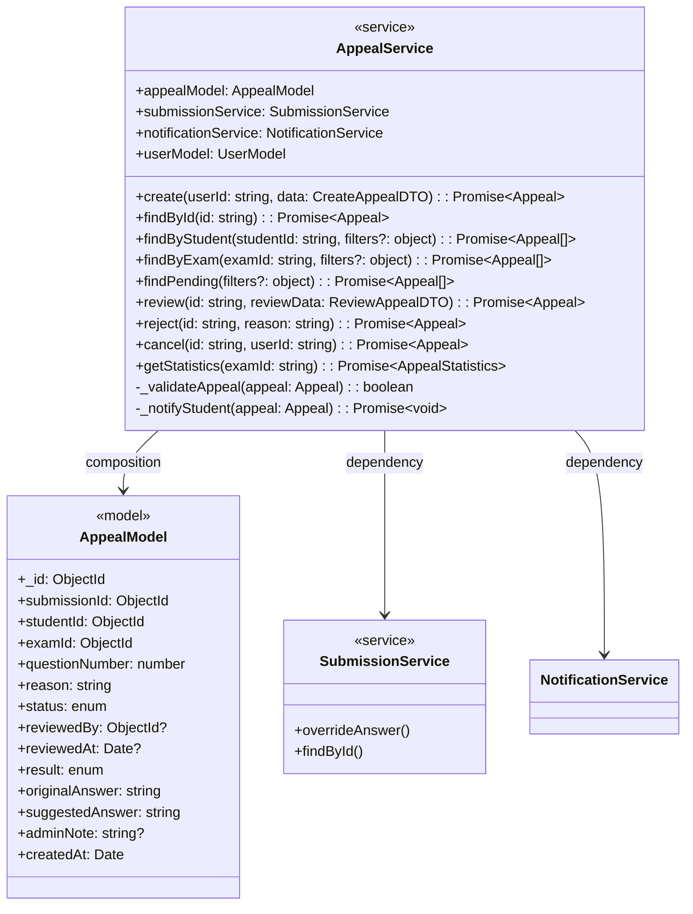
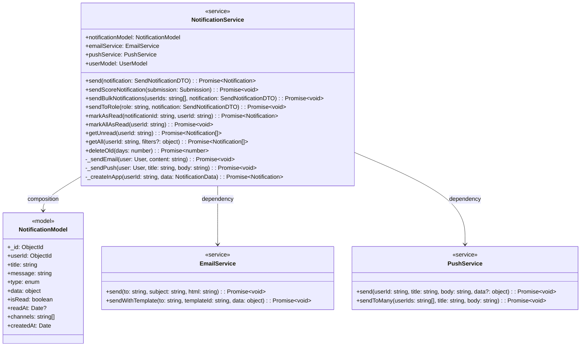
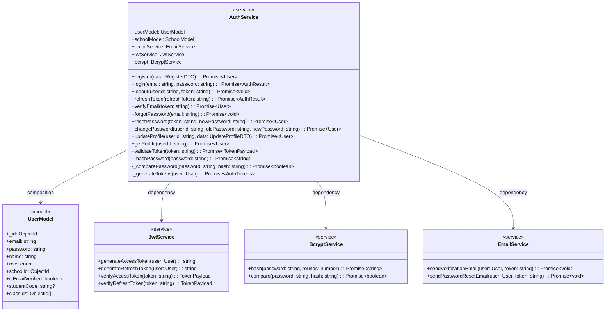
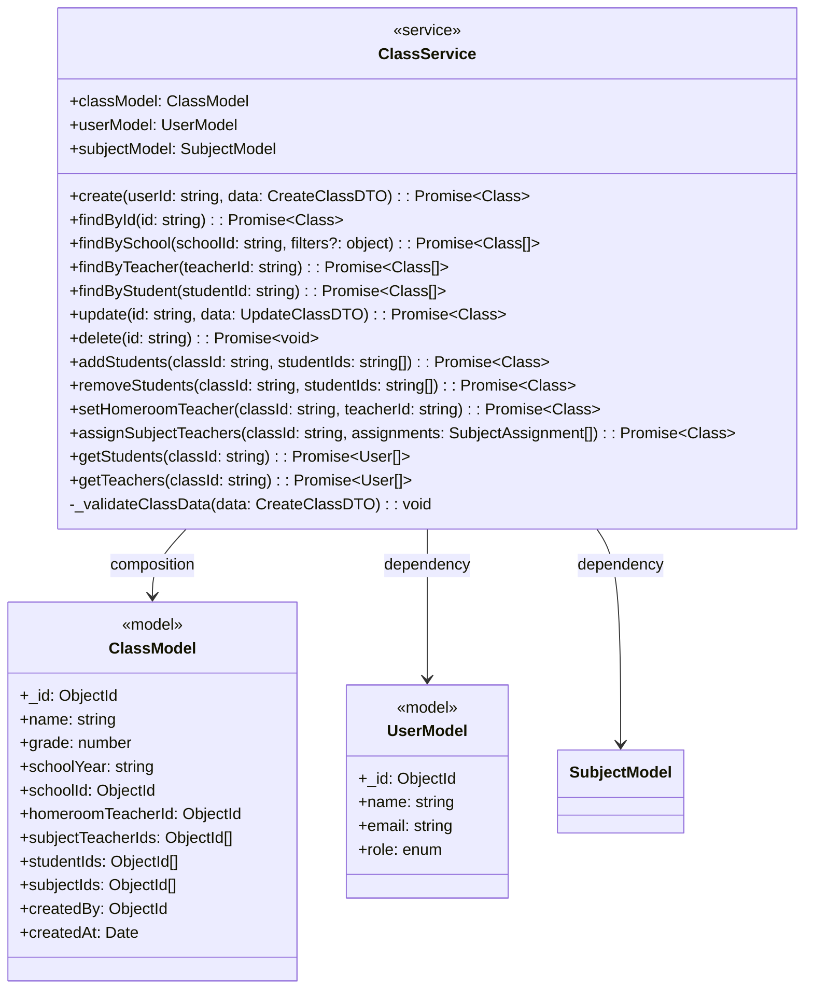
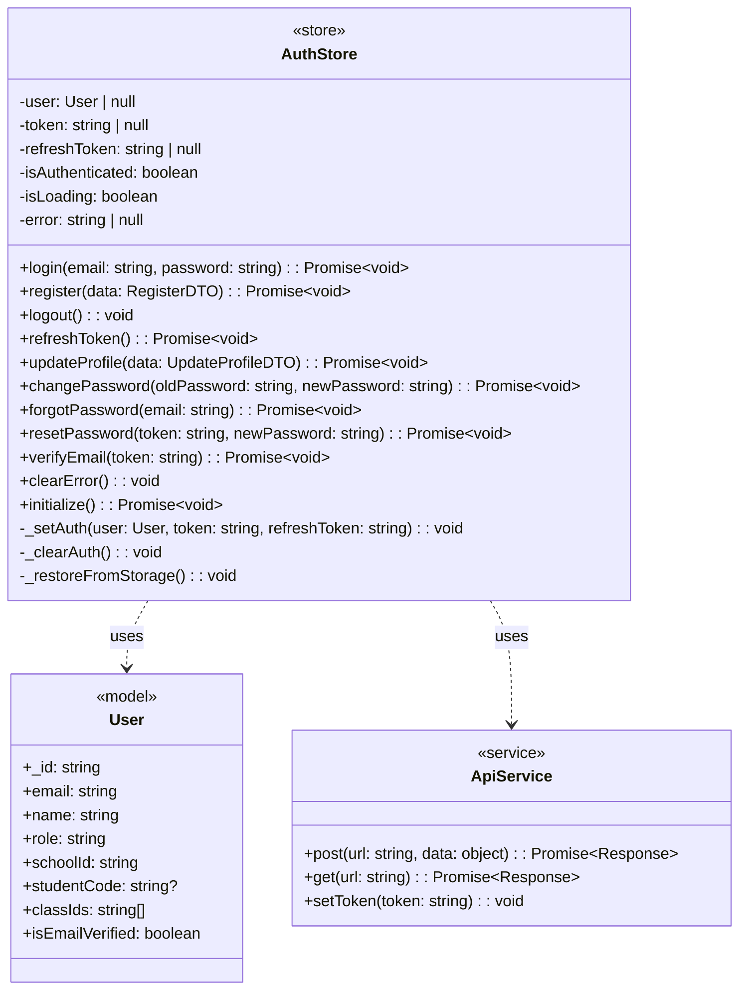
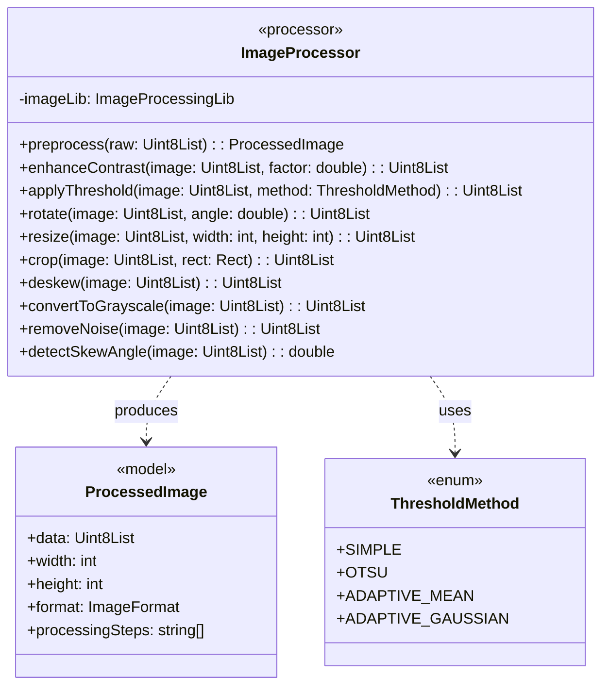
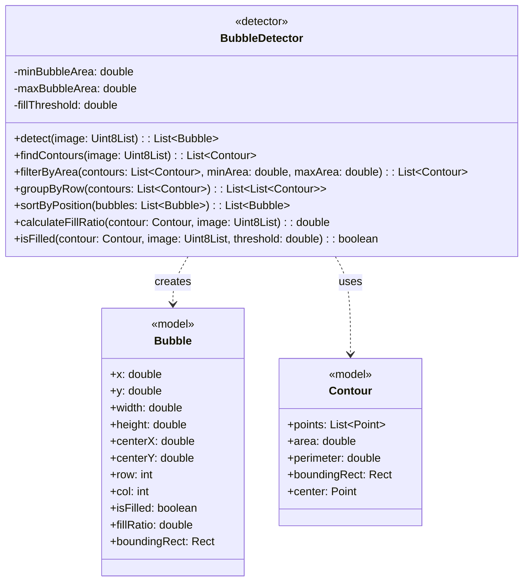
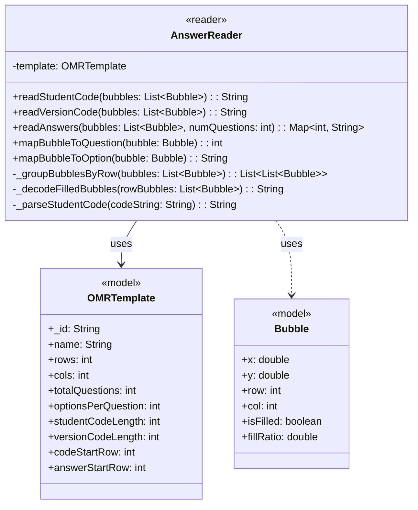

# PHẦN 4.2.2 - THIẾT KẾ LỚP CHI TIẾT

## 4.2.2.4 Lớp AppealService (Backend - Node.js)

**Vị trí**: Gói services, tầng Business Logic

**Mô tả**: AppealService quản lý toàn bộ quy trình phúc khảo từ khi học sinh gửi yêu cầu đến khi giáo viên xem xét và cập nhật kết quả.

**Biểu đồ lớp:**



**Bảng mô tả chi tiết:**

| Thuộc tính | Kiểu | Mô tả |
|------------|------|--------|
| appealModel | AppealModel | Model phúc khảo |
| submissionService | SubmissionService | Service bài nộp |
| notificationService | NotificationService | Service thông báo |
| userModel | UserModel | Model người dùng |

| Phương thức | Tham số | Kiểu trả về | Mô tả |
|-------------|---------|-------------|--------|
| create | userId, data | Promise\<Appeal\> | Tạo yêu cầu phúc khảo mới |
| findById | id: string | Promise\<Appeal\> | Tìm theo ID |
| findByStudent | studentId, filters | Promise\<Appeal[]\> | Tìm theo học sinh |
| findByExam | examId, filters | Promise\<Appeal[]\> | Tìm theo đề thi |
| findPending | filters | Promise\<Appeal[]\> | Tìm các yêu cầu đang chờ |
| review | id, reviewData | Promise\<Appeal\> | Xem xét và phê duyệt |
| reject | id, reason | Promise\<Appeal\> | Từ chối yêu cầu |
| cancel | id, userId | Promise\<Appeal\> | Học sinh hủy yêu cầu |
| getStatistics | examId: string | Promise\<AppealStatistics\> | Thống kê phúc khảo |

---

## 4.2.2.5 Lớp NotificationService (Backend - Node.js)

**Vị trí**: Gói services, tầng Business Logic

**Mô tả**: NotificationService quản lý việc gửi thông báo đến người dùng qua nhiều kênh: email, in-app notification, push notification.

**Biểu đồ lớp:**



**Bảng mô tả chi tiết:**

| Thuộc tính | Kiểu | Mô tả |
|------------|------|--------|
| notificationModel | NotificationModel | Model thông báo |
| emailService | EmailService | Service gửi email |
| pushService | PushService | Service push notification |
| userModel | UserModel | Model người dùng |

| Phương thức | Tham số | Kiểu trả về | Mô tả |
|-------------|---------|-------------|--------|
| send | notification | Promise\<Notification\> | Gửi thông báo đơn lẻ |
| sendScoreNotification | submission | Promise\<void\> | Gửi thông báo điểm số |
| sendBulkNotifications | userIds, notification | Promise\<void\> | Gửi cho nhiều người |
| sendToRole | role, notification | Promise\<void\> | Gửi theo vai trò |
| markAsRead | notificationId, userId | Promise\<Notification\> | Đánh dấu đã đọc |
| markAllAsRead | userId: string | Promise\<void\> | Đánh dấu tất cả đã đọc |
| getUnread | userId: string | Promise\<Notification[]\> | Lấy thông báo chưa đọc |
| getAll | userId, filters | Promise\<Notification[]\> | Lấy tất cả thông báo |

---

## 4.2.2.6 Lớp AuthService (Backend - Node.js)

**Vị trí**: Gói services, tầng Business Logic

**Mô tả**: AuthService quản lý xác thực và phân quyền người dùng, bao gồm đăng ký, đăng nhập, đăng xuất, và quản lý token.

**Biểu đồ lớp:**



**Bảng mô tả chi tiết:**

| Thuộc tính | Kiểu | Mô tả |
|------------|------|--------|
| userModel | UserModel | Model người dùng |
| schoolModel | SchoolModel | Model trường học |
| emailService | EmailService | Service gửi email |
| jwtService | JwtService | Service JWT |
| bcrypt | BcryptService | Service mã hóa mật khẩu |

| Phương thức | Tham số | Kiểu trả về | Mô tả |
|-------------|---------|-------------|--------|
| register | data | Promise\<User\> | Đăng ký tài khoản mới |
| login | email, password | Promise\<AuthResult\> | Đăng nhập |
| logout | userId, token | Promise\<void\> | Đăng xuất |
| refreshToken | refreshToken | Promise\<AuthResult\> | Làm mới token |
| verifyEmail | token: string | Promise\<User\> | Xác thực email |
| forgotPassword | email: string | Promise\<void\> | Quên mật khẩu |
| resetPassword | token, newPassword | Promise\<User\> | Đặt lại mật khẩu |
| changePassword | userId, old, new | Promise\<User\> | Đổi mật khẩu |
| updateProfile | userId, data | Promise\<User\> | Cập nhật thông tin |
| getProfile | userId: string | Promise\<User\> | Lấy thông tin cá nhân |
| validateToken | token: string | Promise\<TokenPayload\> | Kiểm tra token |

---

## 4.2.2.7 Lớp ClassService (Backend - Node.js)

**Vị trí**: Gói services, tầng Business Logic

**Mô tả**: ClassService quản lý các lớp học trong hệ thống, bao gồm tạo lớp, thêm học sinh, phân công giáo viên, và quản lý danh sách lớp.

**Biểu đồ lớp:**



**Bảng mô tả chi tiết:**

| Thuộc tính | Kiểu | Mô tả |
|------------|------|--------|
| classModel | ClassModel | Model lớp học |
| userModel | UserModel | Model người dùng |
| subjectModel | SubjectModel | Model môn học |

| Phương thức | Tham số | Kiểu trả về | Mô tả |
|-------------|---------|-------------|--------|
| create | userId, data | Promise\<Class\> | Tạo lớp học mới |
| findById | id: string | Promise\<Class\> | Tìm theo ID |
| findBySchool | schoolId, filters | Promise\<Class[]\> | Tìm theo trường học |
| findByTeacher | teacherId: string | Promise\<Class[]\> | Tìm theo giáo viên |
| findByStudent | studentId: string | Promise\<Class[]\> | Tìm theo học sinh |
| update | id, data | Promise\<Class\> | Cập nhật lớp học |
| delete | id: string | Promise\<void\> | Xóa lớp học |
| addStudents | classId, studentIds | Promise\<Class\> | Thêm học sinh |
| removeStudents | classId, studentIds | Promise\<Class\> | Xóa học sinh |
| setHomeroomTeacher | classId, teacherId | Promise\<Class\> | Đặt giáo viên chủ nhiệm |
| assignSubjectTeachers | classId, assignments | Promise\<Class\> | Phân công giáo viên bộ môn |
| getStudents | classId: string | Promise\<User[]\> | Lấy danh sách học sinh |
| getTeachers | classId: string | Promise\<User[]\> | Lấy danh sách giáo viên |

---

## 4.2.2.8 Lớp AuthStore (Frontend - React/Zustand)

**Vị trí**: Gói stores, tầng State Management

**Mô tả**: AuthStore quản lý trạng thái xác thực trên ứng dụng web sử dụng Zustand, bao gồm thông tin user, token, và các action đăng nhập/đăng xuất.

**Biểu đồ lớp:**



**Bảng mô tả chi tiết:**

| Thuộc tính | Kiểu | Mô tả |
|------------|------|--------|
| user | User \| null | Thông tin người dùng hiện tại |
| token | string \| null | Access token JWT |
| refreshToken | string \| null | Refresh token |
| isAuthenticated | boolean | Trạng thái đăng nhập |
| isLoading | boolean | Trạng thái loading |
| error | string \| null | Thông báo lỗi |

| Phương thức | Tham số | Kiểu trả về | Mô tả |
|-------------|---------|-------------|--------|
| login | email, password | Promise\<void\> | Đăng nhập |
| register | data | Promise\<void\> | Đăng ký |
| logout | - | void | Đăng xuất |
| refreshToken | - | Promise\<void\> | Làm mới token |
| updateProfile | data | Promise\<void\> | Cập nhật thông tin |
| changePassword | old, new | Promise\<void\> | Đổi mật khẩu |
| forgotPassword | email | Promise\<void\> | Quên mật khẩu |
| resetPassword | token, newPassword | Promise\<void\> | Đặt lại mật khẩu |
| verifyEmail | token | Promise\<void\> | Xác thực email |
| initialize | - | Promise\<void\> | Khởi tạo từ localStorage |

---

## 4.2.2.9 Lớp SubmissionStore (Frontend - React/Zustand)

**Vị trí**: Gói stores, tầng State Management

**Mô tả**: SubmissionStore quản lý trạng thái liên quan đến bài nộp và kết quả thi trên ứng dụng web.

**Biểu đồ lớp:**

```mermaid
classDiagram
    class SubmissionStore {
        <<store>>
        -submissions: Submission[]
        -currentSubmission: Submission | null
        -examScores: Map~string, ExamScoreData~
        -isLoading: boolean
        -error: string | null
        -filters: SubmissionFilters

        +fetchSubmissions(filters?: SubmissionFilters): Promise~void~
        +fetchSubmissionById(id: string): Promise~void~
        +fetchMySubmissions(): Promise~void~
        +fetchExamScores(examId: string): Promise~ExamScoreData~
        +getStatistics(examId: string): Promise~ExamStatistics~
        +updateScore(submissionId: string, score: number): Promise~Submission~
        +clearFilters(): void
        +setFilter(key: string, value: any): void
    }

    class Submission {
        <<model>>
        +_id: string
        +examId: string
        +studentId: string
        +studentCode: string
        +answers: Answer[]
        +totalScore: number
        +maxScore: number
        +status: string
        +submittedAt: Date
    }

    class ExamScoreData {
        <<model>>
        +examId: string
        +submissions: Submission[]
        +statistics: {
            average: number
            highest: number
            lowest: number
            passRate: number
            total: number
        }
        +scoreDistribution: number[]
    }

    class ApiService {
        <<service>>
        +get(url: string): Promise~Response~
        +post(url: string, data: object): Promise~Response~
        +put(url: string, data: object): Promise~Response~
    }

    SubmissionStore ..> Submission : uses
    SubmissionStore ..> ExamScoreData : uses
    SubmissionStore ..> ApiService : uses
```

**Bảng mô tả chi tiết:**

| Thuộc tính | Kiểu | Mô tả |
|------------|------|--------|
| submissions | Submission[] | Danh sách bài nộp |
| currentSubmission | Submission \| null | Bài nộp đang xem |
| examScores | Map | Dữ liệu điểm theo đề thi |
| isLoading | boolean | Trạng thái loading |
| error | string \| null | Thông báo lỗi |
| filters | SubmissionFilters | Bộ lọc |

| Phương thức | Tham số | Kiểu trả về | Mô tả |
|-------------|---------|-------------|--------|
| fetchSubmissions | filters | Promise\<void\> | Lấy danh sách bài nộp |
| fetchSubmissionById | id | Promise\<void\> | Lấy chi tiết bài nộp |
| fetchMySubmissions | - | Promise\<void\> | Lấy bài nộp của tôi |
| fetchExamScores | examId | Promise\<ExamScoreData\> | Lấy điểm theo đề thi |
| getStatistics | examId | Promise\<ExamStatistics\> | Lấy thống kê điểm |
| updateScore | submissionId, score | Promise\<Submission\> | Cập nhật điểm |

---

## 4.2.2.10 Lớp ImageProcessor (Mobile - Flutter)

**Vị trí**: Gói engine, tầng Business Logic

**Mô tả**: ImageProcessor thực hiện các phép biến đổi trên ảnh đầu vào để chuẩn bị cho việc nhận diện OMR: tăng tương phản, áp dụng ngưỡng, xoay, cắt, và chống nghiêng.

**Biểu đồ lớp:**



**Bảng mô tả chi tiết:**

| Thuộc tính | Kiểu | Mô tả |
|------------|------|--------|
| imageLib | ImageProcessingLib | Thư viện xử lý ảnh (OpenCV/Dart) |

| Phương thức | Tham số | Kiểu trả về | Mô tả |
|-------------|---------|-------------|--------|
| preprocess | raw: Uint8List | ProcessedImage | Tiền xử lý đầy đủ |
| enhanceContrast | image, factor | Uint8List | Tăng tương phản |
| applyThreshold | image, method | Uint8List | Áp dụng ngưỡng nhị phân |
| rotate | image, angle | Uint8List | Xoay ảnh theo góc |
| resize | image, width, height | Uint8List | Thay đổi kích thước |
| crop | image, rect | Uint8List | Cắt vùng ảnh |
| deskew | image: Uint8List | Uint8List | Chống nghiêng tự động |
| convertToGrayscale | image | Uint8List | Chuyển sang grayscale |
| removeNoise | image | Uint8List | Lọc nhiễu |
| detectSkewAngle | image | double | Phát hiện góc nghiêng |

---

## 4.2.2.11 Lớp BubbleDetector (Mobile - Flutter)

**Vị trí**: Gói engine, tầng Business Logic

**Mô tả**: BubbleDetector phát hiện và phân loại các bong bóng (vùng tròn được tô) trên ảnh phiếu trả lời OMR, xác định bong bóng nào đã được tô đậm.

**Biểu đồ lớp:**



**Bảng mô tả chi tiết:**

| Thuộc tính | Kiểu | Mô tả |
|------------|------|--------|
| minBubbleArea | double | Diện tích tối thiểu của bong bóng |
| maxBubbleArea | double | Diện tích tối đa của bong bóng |
| fillThreshold | double | Ngưỡng fill ratio để xem là đã tô |

| Phương thức | Tham số | Kiểu trả về | Mô tả |
|-------------|---------|-------------|--------|
| detect | image | List\<Bubble\> | Phát hiện tất cả bong bóng |
| findContours | image | List\<Contour\> | Tìm đường viền trong ảnh |
| filterByArea | contours, min, max | List\<Contour\> | Lọc theo diện tích |
| groupByRow | contours | List\<List\<Contour\>\> | Nhóm theo hàng |
| sortByPosition | bubbles | List\<Bubble\> | Sắp xếp theo vị trí |
| calculateFillRatio | contour, image | double | Tính tỷ lệ tô đầy |
| isFilled | contour, image, threshold | boolean | Kiểm tra đã tô chưa |

---

## 4.2.2.12 Lớp AnswerReader (Mobile - Flutter)

**Vị trí**: Gói engine, tầng Business Logic

**Mô tả**: AnswerReader đọc mã học sinh, mã phiên bản đề, và các đáp án từ danh sách bong bóng đã được phát hiện.

**Biểu đồ lớp:**



**Bảng mô tả chi tiết:**

| Thuộc tính | Kiểu | Mô tả |
|------------|------|--------|
| template | OMRTemplate | Template OMR để mapping |

| Phương thức | Tham số | Kiểu trả về | Mô tả |
|-------------|---------|-------------|--------|
| readStudentCode | bubbles | String | Đọc mã học sinh |
| readVersionCode | bubbles | String | Đọc mã phiên bản đề |
| readAnswers | bubbles, numQuestions | Map\<int, String\> | Đọc đáp án |
| mapBubbleToQuestion | bubble | int | Map bong bóng đến câu hỏi |
| mapBubbleToOption | bubble | String | Map đến đáp án (A, B, C, D) |
| _groupBubblesByRow | bubbles | List\<List\<Bubble\>\> | Nhóm theo hàng |
| _decodeFilledBubbles | rowBubbles | String | Giải mã bong bóng đã tô |
| _parseStudentCode | codeString | String | Parse mã học sinh |

---

## Tổng hợp các lớp

### Bảng tóm tắt tất cả các lớp

| # | Lớp | Nền tảng | Gói | Phương thức | Use Case |
|---|-----|----------|-----|-------------|----------|
| 1 | **AppealService** | Backend | services | 9 | UC-08 (Phúc khảo) |
| 2 | **NotificationService** | Backend | services | 9 | UC-07 (Thông báo) |
| 3 | **AuthService** | Backend | services | 13 | UC-00 (Đăng nhập) |
| 4 | **ClassService** | Backend | services | 12 | UC-03 (Quản lý lớp) |
| 5 | **AuthStore** | Frontend | stores | 12 | UC-00 (Xác thực) |
| 6 | **SubmissionStore** | Frontend | stores | 7 | UC-07 (Xem kết quả) |
| 7 | **ImageProcessor** | Mobile | engine | 10 | UC-02 (Xử lý ảnh) |
| 8 | **BubbleDetector** | Mobile | engine | 7 | UC-02 (Phát hiện bong bóng) |
| 9 | **AnswerReader** | Mobile | engine | 7 | UC-02 (Đọc đáp án) |

### Phân bố theo nền tảng

```
Backend (Node.js)     : 4 lớp (AppealService, NotificationService, 
                           AuthService, ClassService)
Frontend Web (React)  : 2 lớp (AuthStore, SubmissionStore)
Mobile (Flutter)      : 3 lớp (ImageProcessor, BubbleDetector, AnswerReader)
─────────────────────────────────────────────────────────────────────────────
TỔNG CỘNG             : 9 lớp
```

### Các lớp đã loại bỏ (trình bày trong file chính)

| # | Lớp | Lý do |
|---|-----|-------|
| 1 | **SubmissionService** | Lớp cốt lõi - trình bày chi tiết trong mục 4.2.2.1 |
| 2 | **ExamService** | Lớp quan trọng - trình bày chi tiết trong mục 4.2.2.2 |
| 3 | **OMREngine** | Lõi OMR - trình bày chi tiết trong mục 4.2.2.3 |
