# Chương 4: Phân Tích Thiết Kế, Triển Khai và Đánh Giá Hệ Thống

## Mục lục

- [4.1 Thiết kế kiến trúc](#41-thiết-kế-kiến-trúc)
  - [4.1.2 Thiết kế tổng quan](#412-thiết-kế-tổng-quan)
  - [4.1.3 Thiết kế chi tiết gói](#413-thiết-kế-chi-tiết-gói)
- [4.2 Thiết kế chi tiết](#42-thiết-kế-chi-tiết)
  - [4.2.1 Biểu đồ tuần tự](#421-biểu-đồ-tuần-tự)
  - [4.2.2 Thiết kế cơ sở dữ liệu](#422-thiết-kế-cơ-sở-dữ-liệu)

---

## 4.1 Thiết kế kiến trúc

### 4.1.1 Lựa chọn kiến trúc

Hệ thống Smart Grading sử dụng **kiến trúc phân tầng (Layered Architecture)** với 4 tầng chính tuân theo nguyên tắc:

- **Quy tắc phân tầng**: Các gói phải phân tầng rõ ràng, thể hiện sự phụ thuộc một chiều
- **Không phụ thuộc chéo**: Gói tầng dưới không phụ thuộc gói tầng trên
- **Không phụ thuộc bắc cầu**: Không phụ thuộc qua trung gian bỏ qua tầng

| Tầng | Backend (Node.js) | Frontend Web (React) | Mobile (Flutter) |
|-------|-------------------|----------------------|-------------------|
| **Presentation** | - | Pages, Components | Screens, Widgets |
| **Business** | Controllers, Handlers | Stores (Zustand), Hooks | BLoC, Handlers |
| **Service** | AuthService, ExamService... | API Service | Services |
| **Data** | Models (Mongoose) | API Client, Mock Data | Repositories |

---

### 4.1.2 Thiết kế tổng quan - Biểu đồ gói (Package Diagram)

#### 4.1.2.1 Biểu đồ tầng và gói tổng quan

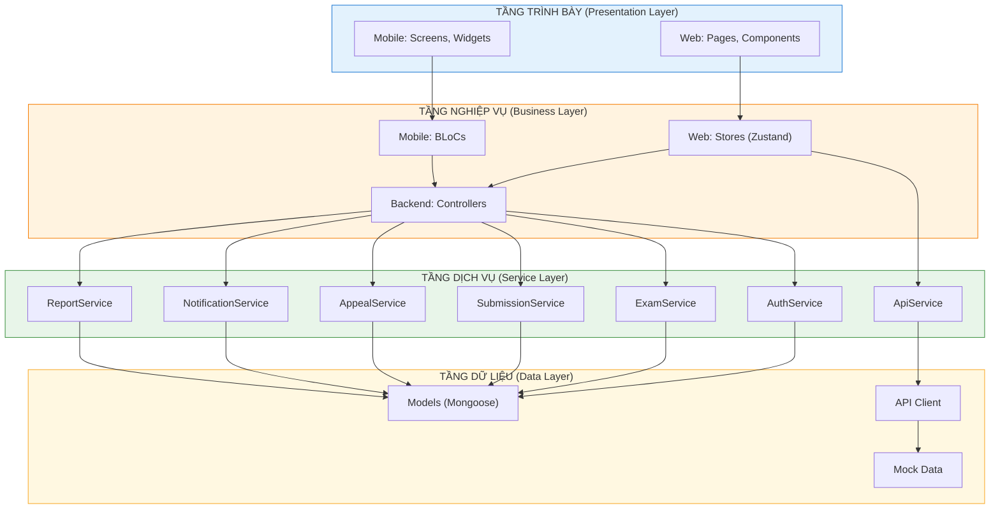

**Quy tắc phụ thuộc một chiều:**

| Tầng | Phụ thuộc vào |
|-------|----------------|
| Presentation | → Business |
| Business | → Service |
| Service | → Data |
| Data | → Database (ngoài kiến trúc) |

**Bảng nhiệm vụ từng gói:**

| Tầng | Nhiệm vụ |
|-------|----------|
| **Presentation** | Giao diện người dùng, tiếp nhận tương tác |
| **Business** | Điều phối request, quản lý state phía client |
| **Service** | Xử lý logic nghiệp vụ, gọi database |
| **Data** | Định nghĩa schema, truy cập dữ liệu |

#### 4.1.2.2 Bảng tổng hợp các gói theo tầng

| Tầng | Backend (Node.js) | Frontend Web (React) | Mobile (Flutter) |
|-------|-------------------|----------------------|------------------|
| **Presentation** | Routers | Pages, Components | Screens, Widgets |
| **Business** | Controllers | Stores (Zustand), Hooks | BLoCs |
| **Service** | AuthService, ExamService, SubmissionService, AppealService, NotificationService, ReportService | ApiService | ApiService, OMREngine |
| **Data** | Models (User, Exam, Submission, Appeal, Class, School, Question, Notification) | Mock Data, API Client (Axios) | Repositories |

#### 4.1.2.3 Chi tiết từng gói

##### Gói tầng Presentation (Backend)

| Gói | Mô tả |
|-----|--------|
| **Routers** | Định nghĩa các endpoint API, tiếp nhận HTTP requests từ client, validation đầu vào, điều phối sang Service tương ứng |

##### Gói tầng Business (Backend)

| Gói | Mô tả |
|-----|--------|
| **Controllers** | Xử lý request/response, gọi Service, map dữ liệu, trả kết quả về client |

##### Gói tầng Service (Backend)

| Gói | Mô tả |
|-----|--------|
| **AuthService** | Đăng ký, đăng nhập, đăng xuất, refresh token, quên/mật khẩu |
| **ExamService** | Tạo/sửa/xóa đề thi, quản lý phiên bản đề, quản lý câu hỏi |
| **SubmissionService** | Nộp bài, chấm điểm tự động (OMR), tổng hợp kết quả |
| **AppealService** | Tiếp nhận phúc khảo, duyệt/từ chối, cập nhật điểm |
| **NotificationService** | Gửi thông báo email, in-app notification |
| **ReportService** | Tổng hợp thống kê, xuất báo cáo Excel/PDF |

##### Gói tầng Data (Backend)

| Gói | Mô tả |
|-----|--------|
| **UserModel** | Lưu thông tin người dùng (học sinh, giáo viên, admin) |
| **ExamModel** | Lưu cấu trúc đề thi, metadata |
| **SubmissionModel** | Lưu bài nộp, điểm số, trạng thái chấm |
| **AppealModel** | Lưu yêu cầu phúc khảo, kết quả duyệt |
| **ClassModel** | Lưu thông tin lớp học |
| **SchoolModel** | Lưu thông tin trường học |
| **QuestionModel** | Lưu ngân hàng câu hỏi |
| **NotificationModel** | Lưu lịch sử thông báo |

##### Gói tầng Presentation (Frontend Web)

| Gói | Mô tả |
|-----|--------|
| **Pages** | Các trang chính: Login, Dashboard, Exams, Submissions, Appeals, Reports, Settings |
| **Components** | Các component tái sử dụng: DataTable, Sidebar, Modal, Form inputs |

##### Gói tầng Business (Frontend Web)

| Gói | Mô tả |
|-----|--------|
| **Stores (Zustand)** | Quản lý state toàn cục: authStore, examStore, submissionStore, appealStore |
| **Hooks** | Custom hooks: useAuth, useExam, useSubmission để truy cập stores và gọi API |

##### Gói tầng Service (Frontend Web)

| Gói | Mô tả |
|-----|--------|
| **ApiService** | Gọi REST API, xử lý HTTP requests, attach token, handle errors |

##### Gói tầng Data (Frontend Web)

| Gói | Mô tả |
|-----|--------|
| **Mock Data** | Dữ liệu mẫu cho development và testing |
| **API Client (Axios)** | Cấu hình axios instance, interceptors, base URL |

##### Gói tầng Presentation (Mobile)

| Gói | Mô tả |
|-----|--------|
| **Screens** | Các màn hình: Login, Home, ExamList, Scan, Score, Profile |
| **Widgets** | Các widget tái sử dụng: ExamCard, ScoreDisplay, ScanOverlay |

##### Gói tầng Business (Mobile)

| Gói | Mô tả |
|-----|--------|
| **BLoCs** | Quản lý state: auth_bloc, exam_bloc, scan_bloc, submission_bloc |

##### Gói tầng Service (Mobile)

| Gói | Mô tả |
|-----|--------|
| **ApiService** | Gọi REST API tương tự Web |
| **OMREngine** | Xử lý nhận diện OMR trên thiết bị di động |

##### Gói tầng Data (Mobile)

| Gói | Mô tả |
|-----|--------|
| **Repositories** | Truy cập dữ liệu local (SharedPreferences, SQLite) và remote API |

#### 4.1.2.4 Biểu đồ gói chi tiết theo miền nghiệp vụ

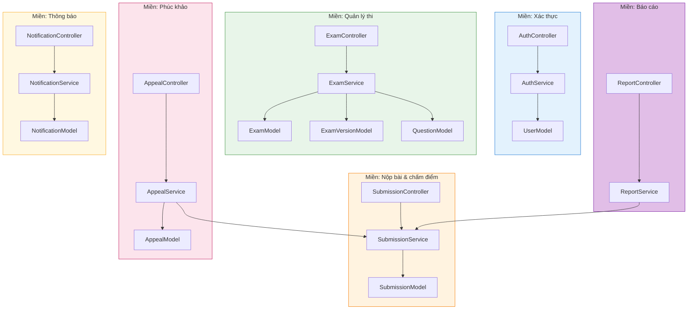

---

### 4.1.3 Thiết kế chi tiết gói - Biểu đồ lớp (Class Diagram)

**Quy tắc**: Thể hiện đầy đủ tên lớp và mô tả chức năng trong từng gói.

---

#### 4.1.3.1 Gói Routers (Backend)

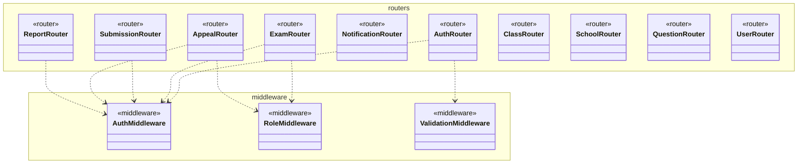

#### 4.1.3.2 Gói Controllers (Backend)

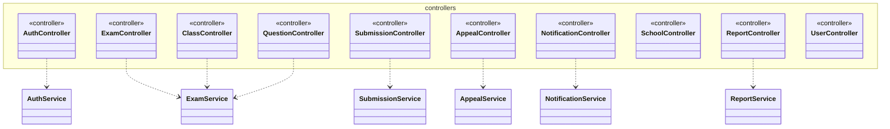

#### 4.1.3.3 Gói Services (Backend)

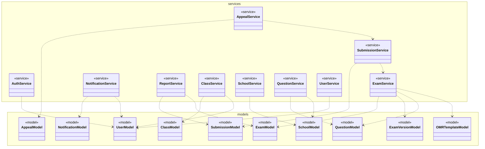

#### 4.1.3.4 Gói Models (Backend)

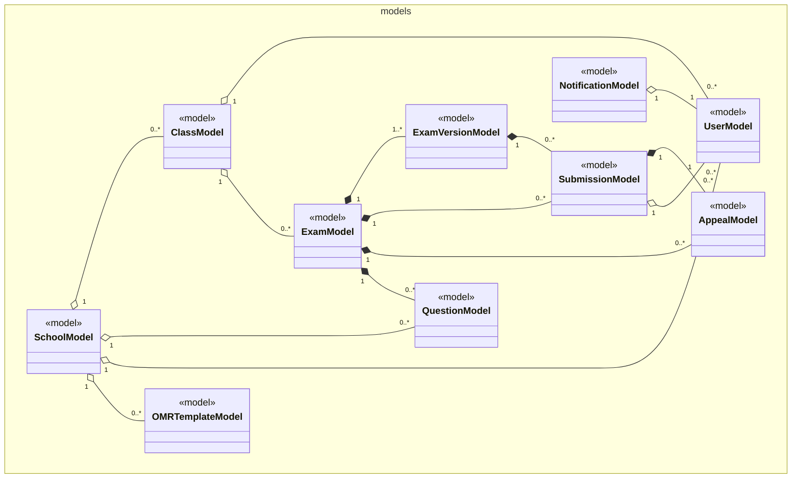

#### 4.1.3.5 Gói Pages (Frontend Web)

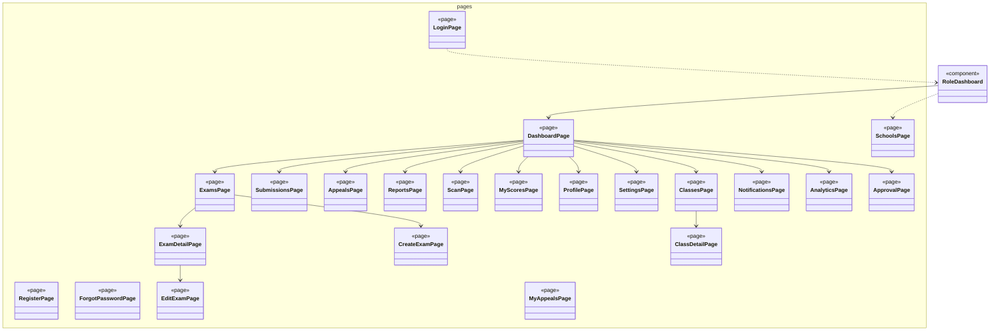

#### 4.1.3.6 Gói Components (Frontend Web)

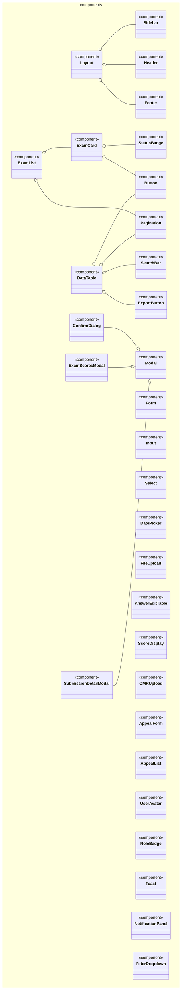

#### 4.1.3.7 Gói Stores (Frontend Web)

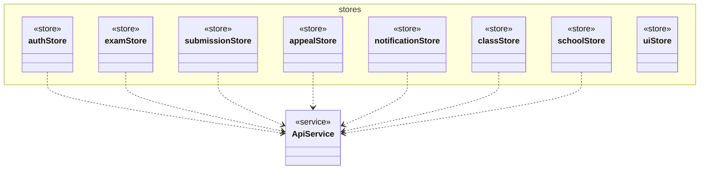

#### 4.1.3.8 Gói Hooks (Frontend Web)

```mermaid
classDiagram
    namespace hooks {
        class useAuth { <<hook>> }
        class useExam { <<hook>> }
        class useExams { <<hook>> }
        class useSubmission { <<hook>> }
        class useSubmissions { <<hook>> }
        class useAppeal { <<hook>> }
        class useAppeals { <<hook>> }
        class useNotifications { <<hook>> }
        class useClass { <<hook>> }
        class useClasses { <<hook>> }
        class useSchool { <<hook>> }
        class useSchools { <<hook>> }
        class useModal { <<hook>> }
        class useToast { <<hook>> }
        class usePagination { <<hook>> }
        class useDebounce { <<hook>> }
    }

    namespace stores {
        class authStore { <<store>> }
        class examStore { <<store>> }
        class submissionStore { <<store>> }
        class appealStore { <<store>> }
        class notificationStore { <<store>> }
        class classStore { <<store>> }
        class schoolStore { <<store>> }
        class uiStore { <<store>> }
    }

    useAuth ..> authStore
    useExam ..> examStore
    useExams ..> examStore
    useSubmission ..> submissionStore
    useSubmissions ..> submissionStore
    useAppeal ..> appealStore
    useAppeals ..> appealStore
    useNotifications ..> notificationStore
    useClass ..> classStore
    useClasses ..> classStore
    useSchool ..> schoolStore
    useSchools ..> schoolStore
    useModal ..> uiStore
    useToast ..> uiStore
```

#### 4.1.3.9 Gói Screens (Mobile)

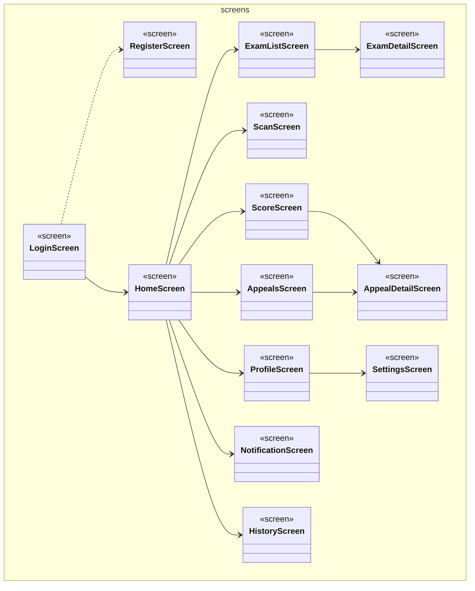

#### 4.1.3.10 Gói Widgets (Mobile)

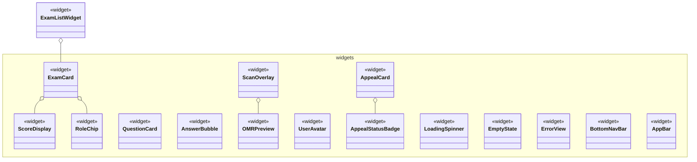

#### 4.1.3.11 Gói BLoCs (Mobile)

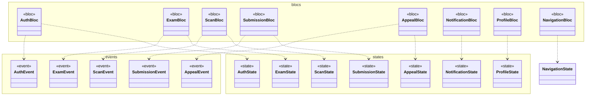

#### 4.1.3.12 Gói ApiService & Repositories (Mobile)

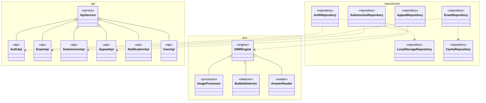

#### 4.1.3.13 Tổng hợp quan hệ giữa các gói

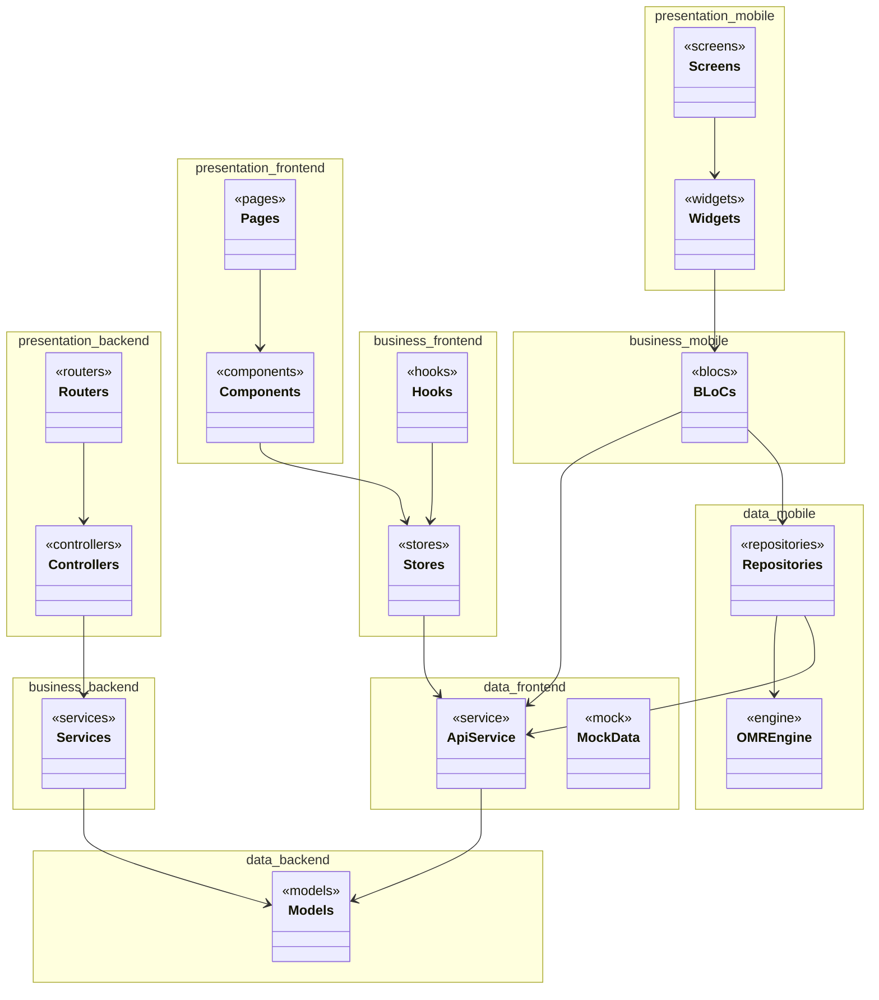

---

## 4.2 Thiết kế chi tiết

### 4.2.1 Thiết kế chi tiết - Biểu đồ tuần tự

#### Use Case 1: Tạo và xuất bản đề thi (Create and Publish Exam)

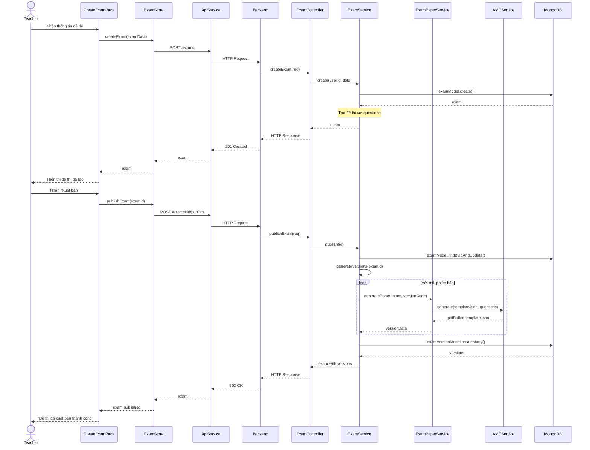

#### Use Case 2: Quét và chấm điểm OMR (Scan and Grade OMR)

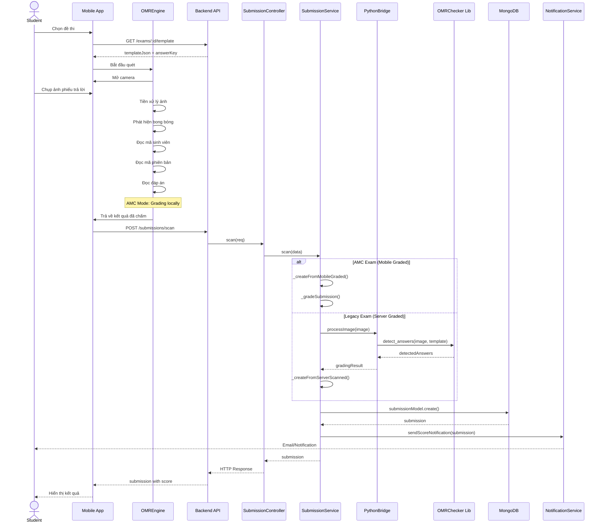

#### Use Case 3: Nộp và xử lý phúc khảo (Submit and Review Appeal)

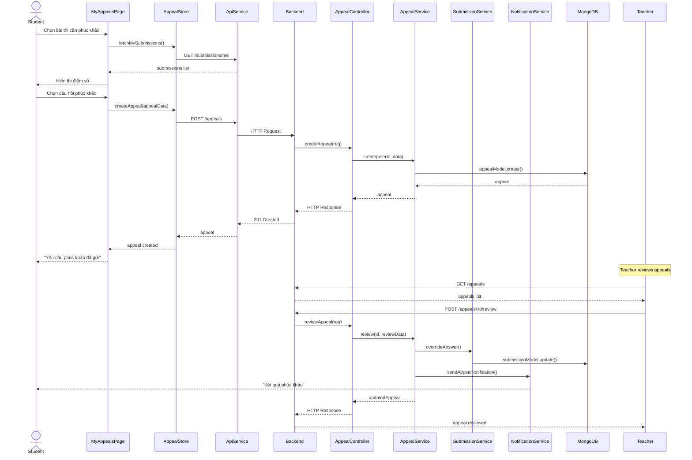

---

### 4.2.2 Thiết kế lớp

Phần này trình bày chi tiết **3 lớp chủ đạo** nhất của hệ thống Smart Grading, bao gồm đầy đủ thuộc tính và phương thức. Các lớp được lựa chọn dựa trên vai trò cốt lõi trong hệ thống:

- **SubmissionService**: Lớp trung tâm của chức năng chấm thi OMR
- **ExamService**: Lớp quản lý vòng đời đề thi
- **OMREngine**: Lớp xử lý nhận diện OMR trên thiết bị di động

---

#### 4.2.2.1 Lớp SubmissionService (Backend - Node.js)

**Vị trí**: Gói Services, tầng Business Logic

**Mô tả**: SubmissionService là **lớp cốt lõi** của hệ thống Smart Grading, đảm nhiệm toàn bộ logic xử lý bài nộp từ việc tiếp nhận kết quả quét OMR, chấm điểm tự động, đến việc lưu trữ và thống kê kết quả thi.

**Biểu đồ lớp:**

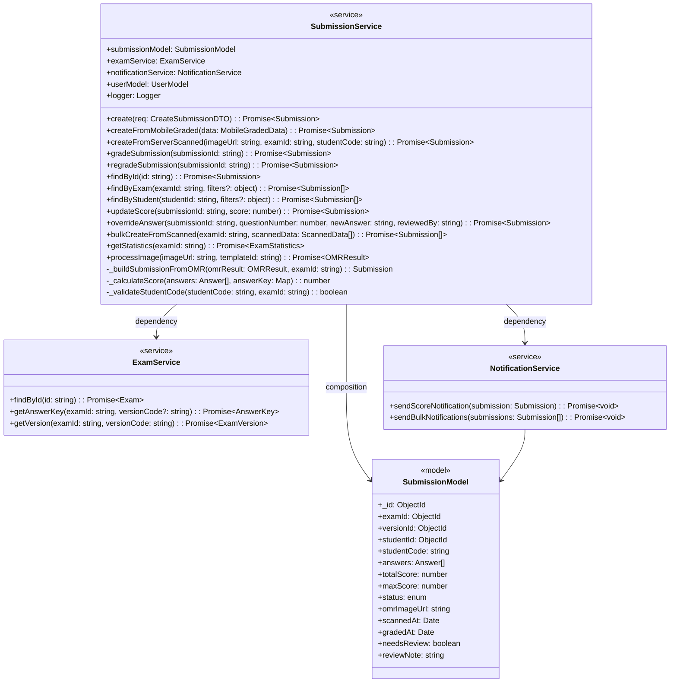

**Bảng mô tả chi tiết thuộc tính và phương thức:**

| Thuộc tính | Kiểu | Mô tả | Phạm vi |
|-------------|------|--------|---------|
| submissionModel | SubmissionModel | Tham chiếu đến model bài nộp trong MongoDB | private |
| examService | ExamService | Service quản lý đề thi, dùng để lấy đáp án | private |
| notificationService | NotificationService | Service gửi thông báo điểm số | private |
| userModel | UserModel | Model người dùng để tra cứu thông tin học sinh | private |
| logger | Logger | Logger ghi nhật ký hoạt động | private |

| Phương thức | Tham số | Kiểu trả về | Mô tả |
|-------------|---------|-------------|--------|
| **Các phương thức khởi tạo và tạo mới** ||||
| create | req: CreateSubmissionDTO | Promise\<Submission\> | Tạo bài nộp mới từ dữ liệu thủ công |
| createFromMobileGraded | data: MobileGradedData | Promise\<Submission\> | Tạo bài nộp từ kết quả chấm trên mobile (AMC Mode) |
| createFromServerScanned | imageUrl, examId, studentCode | Promise\<Submission\> | Tạo bài nộp từ ảnh quét gửi lên server (Legacy Mode) |
| **Các phương thức chấm điểm** ||||
| gradeSubmission | submissionId: string | Promise\<Submission\> | Chấm điểm bài nộp dựa trên đáp án |
| regradeSubmission | submissionId: string | Promise\<Submission\> | Chấm lại bài nộp (sau khi cập nhật đáp án đề thi) |
| updateScore | submissionId, score | Promise\<Submission\> | Cập nhật điểm thủ công |
| overrideAnswer | submissionId, questionNumber, newAnswer, reviewedBy | Promise\<Submission\> | Ghi đè đáp án khi phúc khảo được chấp nhận |
| **Các phương thức truy vấn** ||||
| findById | id: string | Promise\<Submission\> | Tìm bài nộp theo ID |
| findByExam | examId, filters | Promise\<Submission[]\> | Tìm tất cả bài nộp theo đề thi, có lọc |
| findByStudent | studentId, filters | Promise\<Submission[]\> | Tìm bài nộp theo học sinh |
| getStatistics | examId: string | Promise\<ExamStatistics\> | Lấy thống kê điểm của đề thi |
| **Các phương thức xử lý hàng loạt** ||||
| bulkCreateFromScanned | examId, scannedData | Promise\<Submission[]\> | Tạo nhiều bài nộp từ danh sách dữ liệu quét |
| processImage | imageUrl, templateId | Promise\<OMRResult\> | Xử lý ảnh OMR trên server |
| **Các phương thức nội bộ** ||||
| _buildSubmissionFromOMR | omrResult, examId | Submission | Xây dựng object Submission từ kết quả OMR |
| _calculateScore | answers, answerKey | number | Tính điểm dựa trên đáp án |
| _validateStudentCode | studentCode, examId | boolean | Kiểm tra mã học sinh có hợp lệ |

---

#### 4.2.2.2 Lớp ExamService (Backend - Node.js)

**Vị trí**: Gói Services, tầng Business Logic

**Mô tả**: ExamService quản lý toàn bộ vòng đời của đề thi từ giai đoạn tạo mới, cập nhật câu hỏi, xuất bản đề thi, đến việc sinh các phiên bản đề (với đáp án khác nhau) phục vụ chống gian lận thi cử.

**Biểu đồ lớp:**

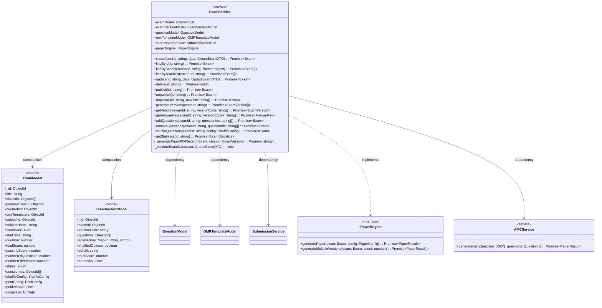

**Bảng mô tả chi tiết thuộc tính và phương thức:**

| Thuộc tính | Kiểu | Mô tả | Phạm vi |
|-------------|------|--------|---------|
| examModel | ExamModel | Model đề thi trong MongoDB | private |
| examVersionModel | ExamVersionModel | Model phiên bản đề | private |
| questionModel | QuestionModel | Model câu hỏi trong ngân hàng đề | private |
| omrTemplateModel | OMRTemplateModel | Model template OMR | private |
| submissionService | SubmissionService | Service bài nộp để lấy thống kê | private |
| paperEngine | IPaperEngine | Engine tạo đề thi PDF | private |

| Phương thức | Tham số | Kiểu trả về | Mô tả |
|-------------|---------|-------------|--------|
| **Các phương thức CRUD cơ bản** ||||
| create | userId, data | Promise\<Exam\> | Tạo đề thi mới với thông tin cơ bản |
| findById | id: string | Promise\<Exam\> | Tìm đề thi theo ID |
| findBySchool | schoolId, filters | Promise\<Exam[]\> | Tìm đề thi theo trường học |
| findByTeacher | teacherId: string | Promise\<Exam[]\> | Tìm đề thi do giáo viên tạo |
| update | id, data | Promise\<Exam\> | Cập nhật thông tin đề thi |
| delete | id: string | Promise\<void\> | Xóa đề thi và các phiên bản |
| **Các phương thức xuất bản** ||||
| publish | id: string | Promise\<Exam\> | Xuất bản đề thi, sinh các phiên bản |
| unpublish | id: string | Promise\<Exam\> | Hủy xuất bản, không cho phép nộp bài |
| duplicate | id, newTitle | Promise\<Exam\> | Tạo bản sao đề thi để tái sử dụng |
| **Các phương thức quản lý phiên bản** ||||
| generateVersions | examId: string | Promise\<ExamVersion[]\> | Sinh các phiên bản đề với đáp án khác nhau |
| getVersion | examId, versionCode | Promise\<ExamVersion\> | Lấy phiên bản đề cụ thể |
| getAnswerKey | examId, versionCode | Promise\<AnswerKey\> | Lấy đáp án của phiên bản |
| **Các phương thức quản lý câu hỏi** ||||
| addQuestions | examId, questionIds | Promise\<Exam\> | Thêm câu hỏi vào đề thi |
| removeQuestions | examId, questionIds | Promise\<Exam\> | Xóa câu hỏi khỏi đề thi |
| shuffleQuestions | examId, config | Promise\<Exam\> | Cấu hình xáo trộn câu hỏi |
| **Các phương thức thống kê** ||||
| getStatistics | id: string | Promise\<ExamStatistics\> | Lấy thống kê điểm và tỷ lệ |
| **Các phương thức nội bộ** ||||
| _generatePaperPDF | exam, version | Promise\<string\> | Sinh file PDF đề thi |
| _validateExamData | data | void | Kiểm tra dữ liệu đề thi hợp lệ |

---

#### 4.2.2.3 Lớp OMREngine (Mobile - Flutter)

**Vị trí**: Gói Engine, tầng Business Logic

**Mô tả**: OMREngine là lớp xử lý nhận diện OMR trên thiết bị di động, thực hiện chấm thi ngay trên smartphone mà không cần gửi ảnh lên server. Lớp này sử dụng các thuật toán xử lý ảnh để phát hiện bong bóng đã tô và đọc đáp án.

**Biểu đồ lớp:**

```mermaid
classDiagram
    class OMREngine {
        <<engine>>
        -imageProcessor: ImageProcessor
        -bubbleDetector: BubbleDetector
        -answerReader: AnswerReader
        -template: OMRTemplate?
        -answerKey: Map~int, String~?
        -isInitialized: boolean

        +initialize(template: OMRTemplate): void
        +processImage(image: Uint8List): OMRResult
        +setAnswerKey(answerKey: Map~int, String~): void
        +calibrate(image: Uint8List): CalibrationResult
        +detectBubbles(image: Uint8List): List~Bubble~
        +readAnswers(bubbles: List~Bubble~): Map~int, String~
        +gradeAnswers(userAnswers: Map, correctAnswers: Map): GradeResult
        +preprocessImage(image: Uint8List): Uint8List
        +enhanceContrast(image: Uint8List): Uint8List
        +detectEdges(image: Uint8List): Uint8List
        +findContours(image: Uint8List): List~Contour~
        +validateTemplate(image: Uint8List): boolean
        -_normalizeImage(image: Uint8List): Uint8List
        -_removeNoise(image: Uint8List): Uint8List
        -_detectStudentCode(bubbles: List~Bubble~): String
        -_detectVersionCode(bubbles: List~Bubble~): String
    }

    class ImageProcessor {
        <<processor>>
        +preprocess(raw: Uint8List): ProcessedImage
        +enhanceContrast(image: Uint8List, factor: double): Uint8List
        +applyThreshold(image: Uint8List, method: ThresholdMethod): Uint8List
        +rotate(image: Uint8List, angle: double): Uint8List
        +resize(image: Uint8List, width: int, height: int): Uint8List
        +crop(image: Uint8List, rect: Rect): Uint8List
        +deskew(image: Uint8List): Uint8List
    }

    class BubbleDetector {
        <<detector>>
        +detect(image: Uint8List): List~Bubble~
        +findContours(image: Uint8List): List~Contour~
        +filterByArea(contours: List~Contour~, minArea: double, maxArea: double): List~Contour~
        +groupByRow(contours: List~Contour~): List~List~Contour~~
        +calculateFillRatio(contour: Contour, image: Uint8List): double
        +isFilled(contour: Contour, image: Uint8List, threshold: double): boolean
        +sortByPosition(bubbles: List~Bubble~): List~Bubble~
    }

    class AnswerReader {
        <<reader>>
        +readStudentCode(bubbles: List~Bubble~): String
        +readVersionCode(bubbles: List~Bubble~): String
        +readAnswers(bubbles: List~Bubble~, numQuestions: int): Map~int, String~
        +mapBubbleToQuestion(bubble: Bubble, template: OMRTemplate): int
        +mapBubbleToOption(bubble: Bubble): String
    }

    class OMRTemplate {
        <<model>>
        +_id: String
        +name: String
        +rows: int
        +cols: int
        +totalQuestions: int
        +optionsPerQuestion: int
        +markers: MarkerConfig
        +layout: LayoutConfig
        +studentCodeLength: int
        +versionCodeLength: int
    }

    class OMRResult {
        <<result>>
        +studentCode: String
        +versionCode: String
        +answers: Map~int, String~
        +confidence: double
        +processedImageUrl: String
        +timestamp: DateTime
        +errorMessage: String?
    }

    class Bubble {
        <<model>>
        +x: double
        +y: double
        +width: double
        +height: double
        +row: int
        +col: int
        +isFilled: boolean
        +fillRatio: double
    }

    OMREngine o-- ImageProcessor : composition
    OMREngine o-- BubbleDetector : composition
    OMREngine o-- AnswerReader : composition
    OMREngine --> OMRTemplate : uses
    OMREngine --> OMRResult : produces
    BubbleDetector ..> Bubble : creates
    AnswerReader ..> Bubble : uses
```

**Bảng mô tả chi tiết thuộc tính và phương thức:**

| Thuộc tính | Kiểu | Mô tả | Phạm vi |
|-------------|------|--------|---------|
| imageProcessor | ImageProcessor | Xử lý ảnh: tăng tương phản, xóa nhiễu | private |
| bubbleDetector | BubbleDetector | Phát hiện bong bóng đã tô | private |
| answerReader | AnswerReader | Đọc mã sinh viên, mã phiên bản, đáp án | private |
| template | OMRTemplate? | Template OMR hiện tại | private |
| answerKey | Map\<int, String\>? | Đáp án đúng để so sánh | private |
| isInitialized | boolean | Trạng thái đã khởi tạo | private |

| Phương thức | Tham số | Kiểu trả về | Mô tả |
|-------------|---------|-------------|--------|
| **Các phương thức khởi tạo** ||||
| initialize | template: OMRTemplate | void | Khởi tạo engine với template OMR |
| setAnswerKey | answerKey: Map\<int, String\> | void | Đặt đáp án đúng để chấm điểm |
| **Các phương thức xử lý chính** ||||
| processImage | image: Uint8List | OMRResult | Xử lý ảnh đầy đủ: tiền xử lý → phát hiện → đọc → chấm |
| calibrate | image: Uint8List | CalibrationResult | Hiệu chỉnh góc nghiêng, độ sáng |
| detectBubbles | image: Uint8List | List\<Bubble\> | Phát hiện tất cả bong bóng trong ảnh |
| readAnswers | bubbles: List\<Bubble\> | Map\<int, String\> | Đọc đáp án từ danh sách bong bóng |
| gradeAnswers | userAnswers, correctAnswers | GradeResult | So sánh và chấm điểm |
| **Các phương thức tiền xử lý ảnh** ||||
| preprocessImage | image: Uint8List | Uint8List | Tiền xử lý ảnh: chuẩn hóa, xóa nhiễu |
| enhanceContrast | image: Uint8List | Uint8List | Tăng độ tương phản để dễ nhận diện |
| detectEdges | image: Uint8List | Uint8List | Phát hiện cạnh để tìm vùng bong bóng |
| findContours | image: Uint8List | List\<Contour\> | Tìm đường viền của các đối tượng |
| validateTemplate | image: Uint8List | boolean | Kiểm tra ảnh có đúng template |
| **Các phương thức nội bộ** ||||
| _normalizeImage | image: Uint8List | Uint8List | Chuẩn hóa kích thước, màu sắc |
| _removeNoise | image: Uint8List | Uint8List | Lọc nhiễu khỏi ảnh |
| _detectStudentCode | bubbles: List\<Bubble\> | String | Đọc mã học sinh |
| _detectVersionCode | bubbles: List\<Bubble\> | String | Đọc mã phiên bản đề |

---

#### 4.2.2.4 Biểu đồ tuần tự - Luồng chấm thi OMR

Biểu đồ tuần tự dưới đây thể hiện luồng xử lý chấm thi OMR tự động từ khi học sinh mở ứng dụng, chọn đề thi, chụp ảnh phiếu trả lời đến khi nhận được kết quả điểm số.

```mermaid
sequenceDiagram
    participant Student
    participant MobileApp
    participant OMREngine
    participant ImageProcessor
    participant BubbleDetector
    participant AnswerReader
    participant Backend
    participant SubmissionController
    participant SubmissionService
    participant DB as MongoDB
    participant NotificationService

    Note over Student,DB: GIAI ĐOẠN 1: Khởi tạo

    Student->>MobileApp: Mở ứng dụng
    Student->>MobileApp: Chọn đề thi cần nộp
    MobileApp->>Backend: GET /exams/:id/template
    Backend->>SubmissionController: getTemplate(req)
    SubmissionController->>Backend: template + answerKey
    Backend-->>MobileApp: {template, answerKey}
    MobileApp->>OMREngine: initialize(template, answerKey)
    OMREngine-->>MobileApp: Engine ready
    MobileApp-->>Student: Hiển thị hướng dẫn quét

    Note over Student,DB: GIAI ĐOẠN 2: Chụp và xử lý ảnh

    Student->>MobileApp: Nhấn "Bắt đầu quét"
    MobileApp->>OMREngine: Bật camera
    Student->>MobileApp: Chụp ảnh phiếu trả lời
    MobileApp->>OMREngine: processImage(imageData)

    OMREngine->>ImageProcessor: preprocessImage(rawImage)
    ImageProcessor->>ImageProcessor: convertToGrayscale()
    ImageProcessor->>ImageProcessor: resizeToStandard()
    ImageProcessor-->>OMREngine: normalizedImage

    OMREngine->>ImageProcessor: enhanceContrast(image)
    ImageProcessor-->>OMREngine: enhancedImage

    OMREngine->>ImageProcessor: applyThreshold(image, OTSU)
    ImageProcessor-->>OMREngine: binaryImage

    OMREngine->>ImageProcessor: deskew(image)
    ImageProcessor-->>OMREngine: alignedImage

    OMREngine->>BubbleDetector: detectBubbles(alignedImage)
    BubbleDetector->>BubbleDetector: findContours(image)
    Note over BubbleDetector: Tìm tất cả đường viền

    BubbleDetector->>BubbleDetector: filterByArea(contours, minArea, maxArea)
    Note over BubbleDetector: Lọc bỏ nhiễu nhỏ

    BubbleDetector->>BubbleDetector: groupByRow(contours)
    Note over BubbleDetector: Nhóm theo hàng

    BubbleDetector->>BubbleDetector: sortByPosition(bubbles)
    BubbleDetector-->>OMREngine: sortedBubbles

    OMREngine->>AnswerReader: readStudentCode(sortedBubbles)
    AnswerReader->>AnswerReader: mapBubblesToCodePositions()
    AnswerReader->>AnswerReader: decodeFilledBubbles()
    AnswerReader-->>OMREngine: studentCode

    OMREngine->>AnswerReader: readVersionCode(sortedBubbles)
    AnswerReader-->>OMREngine: versionCode

    OMREngine->>AnswerReader: readAnswers(sortedBubbles, numQuestions)
    AnswerReader-->>OMREngine: userAnswers

    OMREngine->>OMREngine: gradeAnswers(userAnswers, answerKey)
    OMREngine-->>MobileApp: OMRResult {studentCode, answers, score}

    Note over Student,MobileApp: Kết quả: Chấm thi trong ~2-3 giây

    MobileApp-->>Student: Hiển thị kết quả tạm thời
    Student->>MobileApp: Xác nhận nộp bài

    Note over Student,DB: GIAI ĐOẠN 3: Lưu trữ và thông báo

    MobileApp->>Backend: POST /submissions/scan
    Backend->>SubmissionController: scanSubmission(req)
    SubmissionController->>SubmissionService: createFromMobileGraded(data)
    SubmissionService->>SubmissionService: _validateStudentCode()
    SubmissionService->>SubmissionService: _calculateScore()
    SubmissionService->>DB: submissionModel.create()
    DB-->>SubmissionService: submission

    alt Điểm khác biệt lớn (>20% với trung bình)
        SubmissionService->>SubmissionService: flagForReview()
        Note over SubmissionService: Đánh dấu cần kiểm tra
    else Điểm bình thường
        SubmissionService->>SubmissionService: confirmScore()
    end

    SubmissionService->>DB: submissionModel.save()
    DB-->>SubmissionService: savedSubmission

    SubmissionService->>NotificationService: sendScoreNotification(submission)
    NotificationService-->>Student: Email + In-app notification

    SubmissionService-->>SubmissionController: submission
    SubmissionController-->>Backend: HTTP 201
    Backend-->>MobileApp: submission with confirmed score
    MobileApp-->>Student: "Nộp bài thành công! Điểm: X/Y"

    Note over Student,DB: Hoàn thành toàn bộ quy trình
```

---

#### 4.2.2.5 Mối quan hệ giữa các lớp

Biểu đồ dưới đây tổng hợp mối quan hệ giữa 3 lớp chủ đạo và các lớp phụ trợ.

```mermaid
classDiagram
    class SubmissionService {
        <<service>>
        +submissionModel
        +examService
        +notificationService
    }

    class ExamService {
        <<service>>
        +examModel
        +examVersionModel
        +questionModel
        +paperEngine
    }

    class OMREngine {
        <<engine>>
        +imageProcessor
        +bubbleDetector
        +answerReader
    }

    class ImageProcessor {
        <<processor>>
        +preprocess()
        +enhanceContrast()
        +applyThreshold()
    }

    class BubbleDetector {
        <<detector>>
        +detect()
        +filterByArea()
        +groupByRow()
    }

    class AnswerReader {
        <<reader>>
        +readStudentCode()
        +readAnswers()
    }

    class SubmissionModel {
        <<model>>
        +examId
        +answers
        +totalScore
    }

    class ExamModel {
        <<model>>
        +questionIds
        +answerKey
    }

    class ExamVersionModel {
        <<model>>
        +versionCode
        +shuffledOptions
    }

    class NotificationService {
        <<service>>
        +sendScoreNotification()
    }

    SubmissionService --> ExamService : "Lấy đáp án"
    SubmissionService --> NotificationService : "Gửi thông báo"
    SubmissionService --> SubmissionModel : "Lưu trữ"

    ExamService --> ExamModel : "Quản lý"
    ExamService --> ExamVersionModel : "Sinh phiên bản"

    OMREngine --> ImageProcessor : "Xử lý ảnh"
    OMREngine --> BubbleDetector : "Phát hiện bong bóng"
    OMREngine --> AnswerReader : "Đọc đáp án"

    ExamModel "1" *-- "1..*" ExamVersionModel : composition
    ExamVersionModel "1" *-- "0..*" SubmissionModel : composition
    SubmissionModel "1" o-- "1" ExamModel : aggregation

    Note right of SubmissionService: Backend - Node.js
    Note right of ExamService: Backend - Node.js
    Note right of OMREngine: Mobile - Flutter
    Note right of ImageProcessor: Mobile - Flutter
    Note right of BubbleDetector: Mobile - Flutter
    Note right of AnswerReader: Mobile - Flutter
```

---

#### 4.2.2.6 Tóm tắt các lớp chủ đạo

| Lớp | Nền tảng | Gói | Số phương thức | Chức năng chính |
|-----|----------|-----|----------------|-----------------|
| SubmissionService | Backend (Node.js) | services | 14 | Tiếp nhận, chấm điểm, lưu bài nộp |
| ExamService | Backend (Node.js) | services | 17 | Quản lý vòng đời đề thi |
| OMREngine | Mobile (Flutter) | engine | 14 | Xử lý ảnh OMR, chấm thi trên device |
| ImageProcessor | Mobile (Flutter) | engine | 7 | Tiền xử lý ảnh đầu vào |
| BubbleDetector | Mobile (Flutter) | engine | 6 | Phát hiện bong bóng đã tô |
| AnswerReader | Mobile (Flutter) | engine | 5 | Đọc mã và đáp án |

---

**Nội dung chi tiết các lớp:**

| File | Các lớp trình bày |
|------|-------------------|
| **4_Bieu_do_Chuong4.md** (mục 4.2.2.1-4.2.2.3) | SubmissionService, ExamService, OMREngine, Biểu đồ tuần tự, Mối quan hệ |
| **4_2_2_Thiet_ke_lop.md** | AppealService, NotificationService, AuthService, ClassService, AuthStore, SubmissionStore, ImageProcessor, BubbleDetector, AnswerReader |
| **mermaid_diagrams.md** | Code Mermaid cho tất cả các biểu đồ lớp |

---

### 4.2.3 Thiết kế cơ sở dữ liệu

#### Biểu đồ ER tổng quan

```mermaid
erDiagram
    USER ||--o{ CLASS : "enrolls as student"
    USER ||--o{ CLASS : "teaches as homeroom"
    USER ||--o{ CLASS : "teaches as subject"
    USER ||--o{ CLASS : "created"
    
    USER {
        ObjectId _id PK
        string name
        string email UK
        string password
        enum role
        ObjectId schoolId FK
        string studentCode UK
        bool isEmailVerified
        enum registrationStatus
        array classIds
        date dateOfBirth
        string phone
        address address
        timestamp createdAt
        timestamp updatedAt
    }
    
    SCHOOL ||--o{ USER : "has users"
    SCHOOL ||--o{ CLASS : "contains"
    SCHOOL ||--o{ OMR_TEMPLATE : "owns"
    SCHOOL ||--o{ QUESTION : "owns"
    
    SCHOOL {
        ObjectId _id PK
        string name
        string code UK
        string address
        string schoolType
        object settings
        timestamp createdAt
        timestamp updatedAt
    }
    
    CLASS ||--o{ USER : "has students"
    CLASS ||--o{ EXAM : "participates"
    
    CLASS {
        ObjectId _id PK
        string name
        string code
        number gradeLevel
        string academicYear
        ObjectId schoolId FK
        ObjectId homeroomTeacherId FK
        array studentIds
        array subjectTeachers
        timestamp createdAt
        timestamp updatedAt
    }
    
    SUBJECT ||--o{ CLASS : "taught in"
    SUBJECT ||--o{ EXAM : "for"
    
    SUBJECT {
        ObjectId _id PK
        string name
        string code
        string color
        ObjectId schoolId FK
        timestamp createdAt
    }
    
    EXAM ||--o{ EXAM_VERSION : "generates"
    EXAM ||--o{ SUBMISSION : "receives"
    EXAM ||--o{ APPEAL : "has"
    
    EXAM {
        ObjectId _id PK
        string title
        array classIds
        ObjectId primaryClassId FK
        ObjectId createdBy FK
        ObjectId omrTemplateId FK
        ObjectId subjectId FK
        string subjectName
        date examDate
        string startTime
        number duration
        number totalScore
        number passingScore
        number numberOfQuestions
        enum status
        object printConfig
        number numberOfVersions
        array questionIds
        array versions
        object shuffleConfig
        enum paperEngine
        date publishedAt
        date completedAt
        timestamp createdAt
    }
    
    EXAM_VERSION ||--o{ SUBMISSION : "received by"
    
    EXAM_VERSION {
        ObjectId _id PK
        ObjectId examId FK
        string versionCode
        array questions
        map answerKey
        string pdfUrl
        bool shuffledOptions
        number totalScore
        timestamp createdAt
    }
    
    QUESTION ||--o{ EXAM : "included in"
    QUESTION ||--o{ SUBMISSION_ANSWER : "answered in"
    QUESTION ||--o{ APPEAL : "disputed in"
    
    QUESTION {
        ObjectId _id PK
        string content
        enum type
        array options
        string correctAnswer
        number score
        enum difficulty
        ObjectId schoolId FK
        bool isApproved
        string source
        timestamp createdAt
    }
    
    SUBMISSION ||--o{ APPEAL : "has"
    
    SUBMISSION {
        ObjectId _id PK
        ObjectId examId FK
        ObjectId versionId FK
        ObjectId omrTemplateId FK
        ObjectId studentId FK
        string studentCode
        ObjectId classId FK
        array answers
        number totalScore
        number maxScore
        number finalScore
        object images
        object scanMetadata
        enum status
        object omrSummary
        array manualOverrides
        timestamp createdAt
    }
    
    SUBMISSION_ANSWER {
        number position
        ObjectId questionId FK
        string selectedAnswer
        string correctAnswer
        bool isCorrect
        number score
        number maxScore
        object omrData
    }
    
    APPEAL {
        ObjectId _id PK
        ObjectId submissionId FK
        ObjectId examId FK
        ObjectId studentId FK
        ObjectId questionId FK
        string reason
        enum status
        string teacherResponse
        ObjectId reviewedBy
        date reviewedAt
        timestamp createdAt
    }
    
    OMR_TEMPLATE ||--o{ EXAM : "used by"
    
    OMR_TEMPLATE {
        ObjectId _id PK
        string name
        string code UK
        enum level
        object pageConfig
        object zones
        object scannerConfig
        object validationRules
        object templateJson
        bool isActive
        bool isDefault
        number usageCount
        array tags
        timestamp createdAt
    }
    
    NOTIFICATION ||--o{ USER : "sent to"
    
    NOTIFICATION {
        ObjectId _id PK
        ObjectId userId FK
        string type
        string title
        string body
        object data
        bool isRead
        array channels
        timestamp createdAt
    }
    
    AI_CHAT ||--o{ USER : "belongs to"
    
    AI_CHAT {
        ObjectId _id PK
        ObjectId userId FK
        array messages
        object context
        timestamp createdAt
        timestamp updatedAt
    }
    
    AI_REPORT ||--o{ EXAM : "analyzes"
    
    AI_REPORT {
        ObjectId _id PK
        ObjectId examId FK
        object analysis
        array recommendations
        timestamp createdAt
    }
    
    TOKEN {
        ObjectId _id PK
        string token
        ObjectId user FK
        enum type
        date expires
        timestamp createdAt
    }
```

#### Lược đồ MongoDB Collections

```mermaid
erDiagram
    USER {
        ObjectId _id PK
        string name
        string email
        string password
        string role
        ObjectId schoolId
        string studentCode
        boolean isEmailVerified
        string registrationStatus
        array classIds
        object address
        string avatarUrl
        string phone
        date dateOfBirth
        string gender
        boolean isActive
        date createdAt
        date updatedAt
    }
    
    SCHOOL {
        ObjectId _id PK
        string name
        string code
        string address
        string schoolType
        object settings
        object contactInfo
        boolean isActive
        date createdAt
        date updatedAt
    }
    
    EXAM {
        ObjectId _id PK
        string title
        array classIds
        ObjectId primaryClassId
        ObjectId createdBy
        ObjectId omrTemplateId
        ObjectId subjectId
        string subjectName
        date examDate
        string startTime
        number duration
        number totalScore
        number passingScore
        number numberOfQuestions
        string status
        object printConfig
        number numberOfVersions
        array questionIds
        array versions
        object shuffleConfig
        string paperEngine
        date publishedAt
        date completedAt
        number totalStudents
        number totalSubmissions
        date createdAt
        date updatedAt
    }
    
    SUBMISSION {
        ObjectId _id PK
        ObjectId examId
        ObjectId versionId
        ObjectId omrTemplateId
        ObjectId studentId
        string studentCode
        ObjectId classId
        array answers
        number totalScore
        number maxScore
        number finalScore
        object images
        object scanMetadata
        string status
        object omrSummary
        array manualOverrides
        date createdAt
        date updatedAt
    }
    
    QUESTION {
        ObjectId _id PK
        string content
        string type
        array options
        string correctAnswer
        number score
        string difficulty
        ObjectId schoolId
        boolean isApproved
        string source
        array tags
        array attachments
        date createdAt
        date updatedAt
    }
    
    OMR_TEMPLATE {
        ObjectId _id PK
        string name
        string code
        string level
        object pageConfig
        object zones
        object scannerConfig
        object validationRules
        object templateJson
        boolean isActive
        boolean isDefault
        number usageCount
        array tags
        date createdAt
        date updatedAt
    }
    
    APPEAL {
        ObjectId _id PK
        ObjectId submissionId
        ObjectId examId
        ObjectId studentId
        ObjectId questionId
        string reason
        string status
        string teacherResponse
        ObjectId reviewedBy
        date reviewedAt
        date createdAt
        date updatedAt
    }
    
    NOTIFICATION {
        ObjectId _id PK
        ObjectId userId
        string type
        string title
        string body
        object data
        boolean isRead
        array channels
        date createdAt
    }
    
    AI_CHAT {
        ObjectId _id PK
        ObjectId userId
        array messages
        object context
        date createdAt
        date updatedAt
    }
    
    USER ||--o{ SUBMISSION : "submits"
    USER ||--o{ APPEAL : "creates"
    EXAM ||--o{ SUBMISSION : "receives"
    EXAM ||--o{ APPEAL : "has"
    QUESTION ||--o{ APPEAL : "disputed in"
    SUBMISSION ||--o{ APPEAL : "has"
    OMR_TEMPLATE ||--o{ EXAM : "used by"
```

---

## Tổng kết các biểu đồ

| Biểu đồ | Số lượng | Mục đích |
|---------|----------|----------|
| **Layer Diagram** | 1 | Kiến trúc tổng quan 4 tầng |
| **Package Diagram** | 3 | Backend, Frontend Web, Mobile App |
| **Class Diagram** | 3 | Business Logic, Data Access, Presentation |
| **Sequence Diagram** | 3 | Tạo đề thi, Quét OMR, Phúc khảo |
| **E-R Diagram** | 2 | Tổng quan, MongoDB Collections |

---

## Ghi chú

1. **Layer Diagram**: Thể hiện 4 tầng chính của kiến trúc phân tầng
2. **Package Diagram**: Thể hiện các gói/thành phần trong mỗi tầng của Backend, Frontend Web, Mobile
3. **Class Diagram**: Thể hiện chi tiết các lớp trong từng gói
4. **Sequence Diagram**: Thể hiện luồng truyền thông điệp cho 3 use case chính