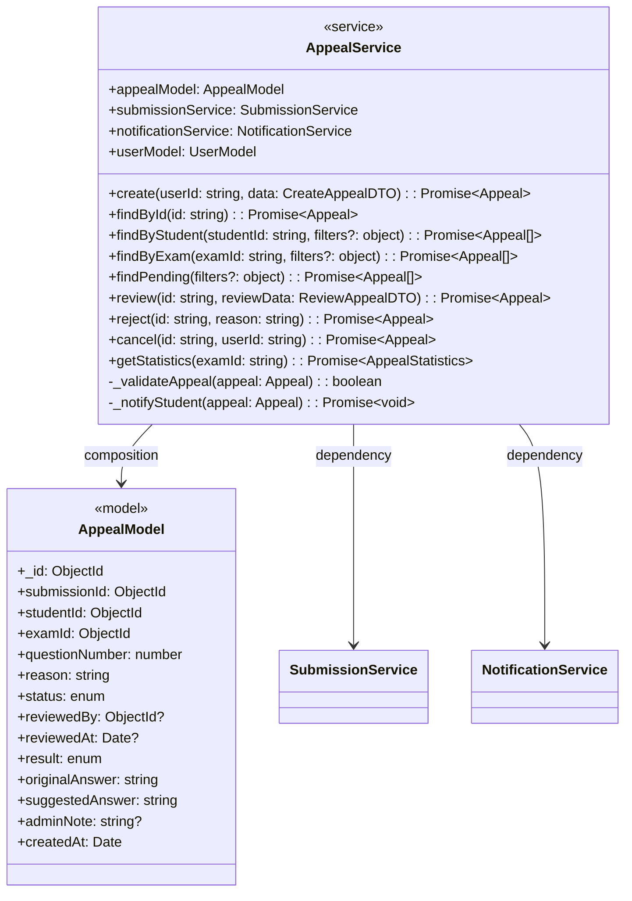
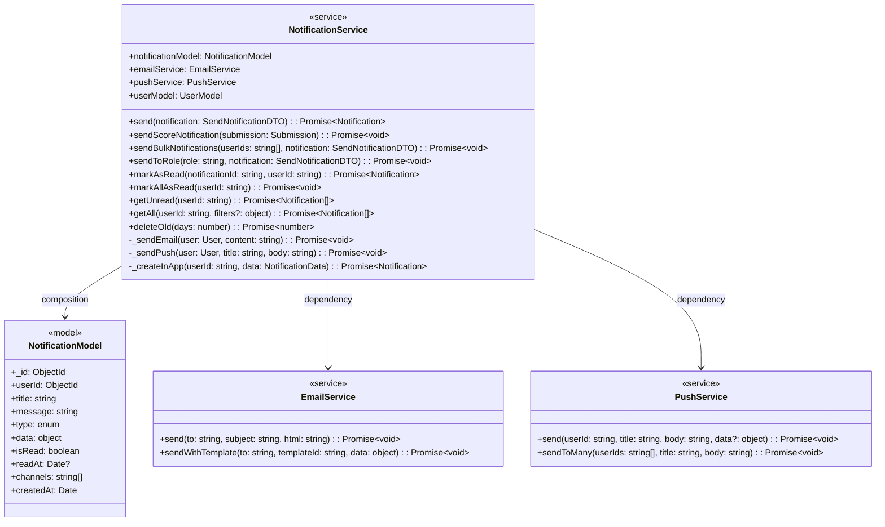
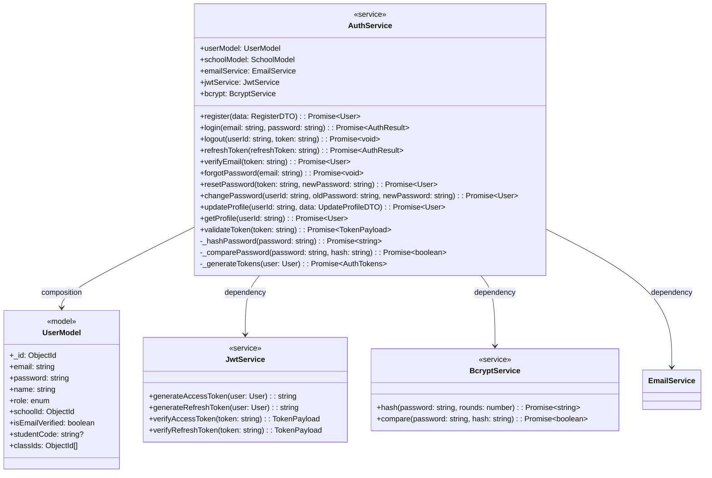
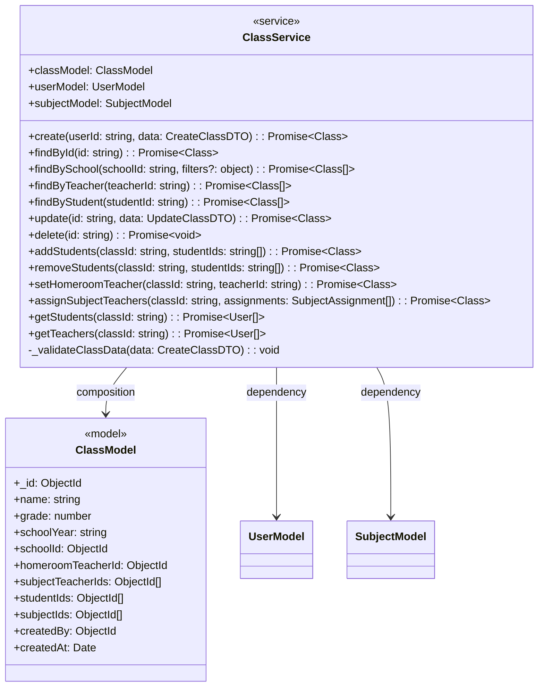
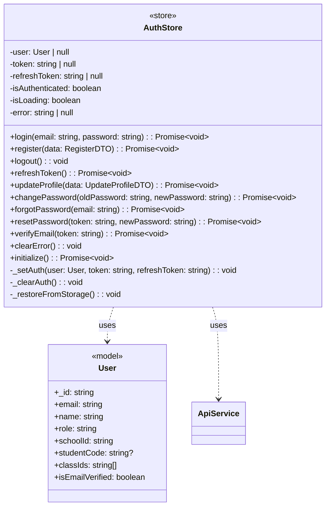
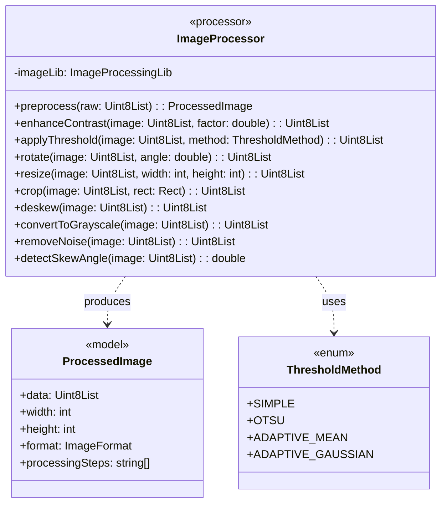
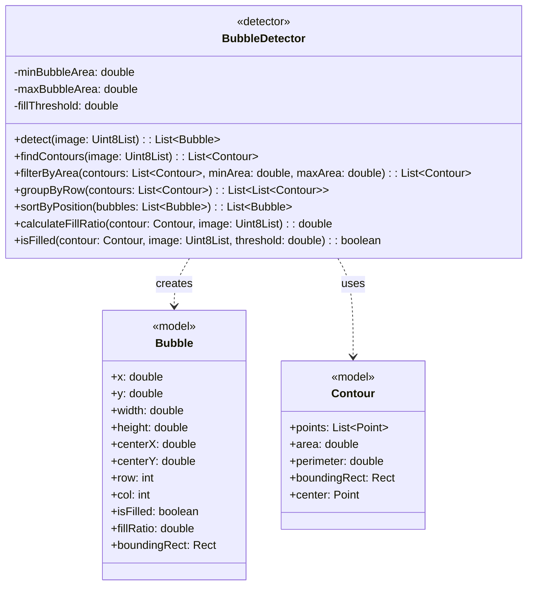
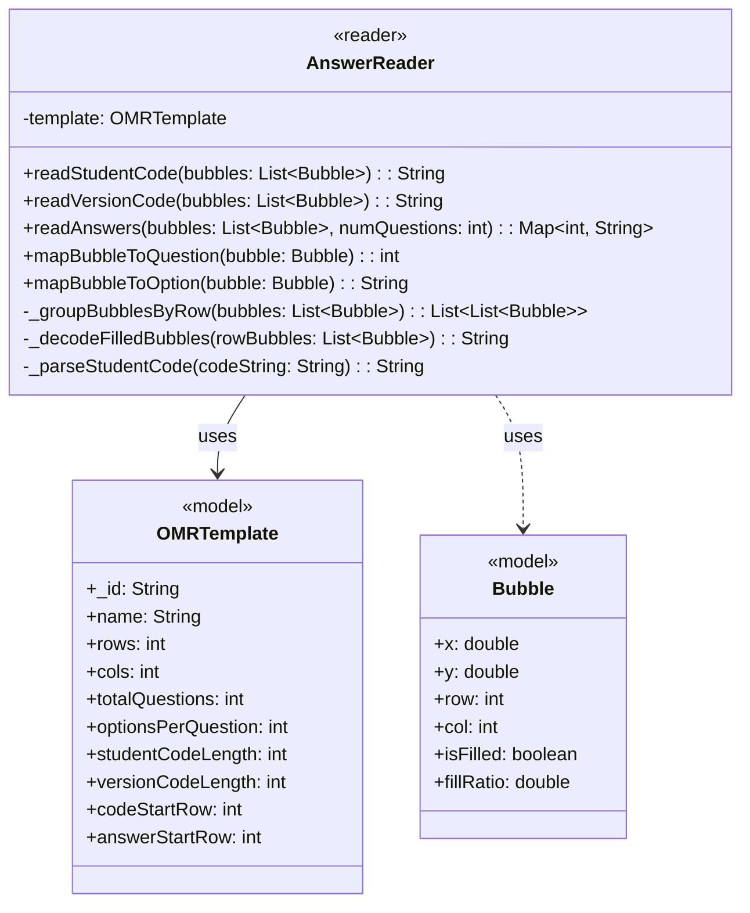

# PHẦN 4.2.2 - THIẾT KẾ LỚP CHI TIẾT

---

# PHẦN 4.2.2.4 - LỚP AppealService (Backend)

## 4.2.2.4 Lớp AppealService



---

# PHẦN 4.2.2.5 - LỚP NotificationService (Backend)

## 4.2.2.5 Lớp NotificationService



---

# PHẦN 4.2.2.6 - LỚP AuthService (Backend)

## 4.2.2.6 Lớp AuthService



---

# PHẦN 4.2.2.7 - LỚP ClassService (Backend)

## 4.2.2.7 Lớp ClassService



---

# PHẦN 4.2.2.8 - LỚP AuthStore (Frontend)

## 4.2.2.8 Lớp AuthStore



---

# PHẦN 4.2.2.9 - LỚP SubmissionStore (Frontend)

## 4.2.2.9 Lớp SubmissionStore

```mermaid
classDiagram
    class SubmissionStore {
        <<store>>
        -submissions: Submission[]
        -currentSubmission: Submission | null
        -examScores: Map~string, ExamScoreData~
        -isLoading: boolean
        -error: string | null
        -filters: SubmissionFilters

        +fetchSubmissions(filters?: SubmissionFilters): Promise~void~
        +fetchSubmissionById(id: string): Promise~void~
        +fetchMySubmissions(): Promise~void~
        +fetchExamScores(examId: string): Promise~ExamScoreData~
        +getStatistics(examId: string): Promise~ExamStatistics~
        +updateScore(submissionId: string, score: number): Promise~Submission~
        +clearFilters(): void
        +setFilter(key: string, value: any): void
    }

    class Submission {
        <<model>>
        +_id: string
        +examId: string
        +studentId: string
        +studentCode: string
        +answers: Answer[]
        +totalScore: number
        +maxScore: number
        +status: string
        +submittedAt: Date
    }

    class ExamScoreData {
        <<model>>
        +examId: string
        +submissions: Submission[]
        +statistics: {
            average: number
            highest: number
            lowest: number
            passRate: number
            total: number
        }
        +scoreDistribution: number[]
    }

    SubmissionStore ..> Submission : uses
    SubmissionStore ..> ExamScoreData : uses
```

---

# PHẦN 4.2.2.10 - LỚP ImageProcessor (Mobile)

## 4.2.2.10 Lớp ImageProcessor



---

# PHẦN 4.2.2.11 - LỚP BubbleDetector (Mobile)

## 4.2.2.11 Lớp BubbleDetector



---

# PHẦN 4.2.2.12 - LỚP AnswerReader (Mobile)

## 4.2.2.12 Lớp AnswerReader



---

# TỔNG HỢP CÁC LỚP

## Bảng tóm tắt tất cả các lớp

| # | Lớp | Nền tảng | Gói | Phương thức | Use Case |
|---|-----|----------|-----|-------------|----------|
| 1 | **AppealService** | Backend | services | 9 | UC-08 (Phúc khảo) |
| 2 | **NotificationService** | Backend | services | 9 | UC-07 (Thông báo) |
| 3 | **AuthService** | Backend | services | 13 | UC-00 (Đăng nhập) |
| 4 | **ClassService** | Backend | services | 12 | UC-03 (Quản lý lớp) |
| 5 | **AuthStore** | Frontend | stores | 12 | UC-00 (Xác thực) |
| 6 | **SubmissionStore** | Frontend | stores | 7 | UC-07 (Xem kết quả) |
| 7 | **ImageProcessor** | Mobile | engine | 10 | UC-02 (Xử lý ảnh) |
| 8 | **BubbleDetector** | Mobile | engine | 7 | UC-02 (Phát hiện bong bóng) |
| 9 | **AnswerReader** | Mobile | engine | 7 | UC-02 (Đọc đáp án) |

## Các lớp trình bày trong file chính

| # | Lớp | Mục | Ghi chú |
|---|-----|-----|---------|
| 1 | SubmissionService | 4.2.2.1 | Lớp cốt lõi |
| 2 | ExamService | 4.2.2.2 | Lớp quan trọng |
| 3 | OMREngine | 4.2.2.3 | Lõi OMR |
