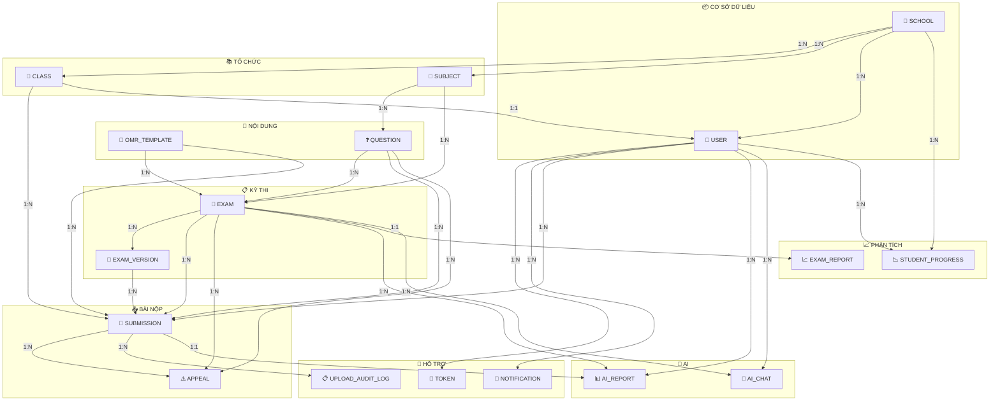

# SMART GRADING - Sơ đồ ER Đơn giản

## Sơ đồ ER (Chỉ tên bảng)

```mermaid
erDiagram

    %% ==================== USER & AUTH ====================
    USER ||--o{ TOKEN : ""
    USER ||--o{ NOTIFICATION : ""
    
    USER {
        string name
        string email
        string role
        ObjectId schoolId
        array classIds
    }
    
    TOKEN {
        string token
        ObjectId userId
        string type
        date expires
    }

    %% ==================== SCHOOL ====================
    SCHOOL ||--o{ USER : ""
    SCHOOL ||--o{ CLASS : ""
    SCHOOL ||--o{ SUBJECT : ""
    SCHOOL ||--o{ OMR_TEMPLATE : ""
    SCHOOL ||--o{ QUESTION : ""
    SCHOOL ||--o{ STUDENT_PROGRESS : ""
    
    SCHOOL {
        string name
        string code
        string schoolType
    }

    %% ==================== CLASS & SUBJECT ====================
    CLASS ||--o| USER : "homeroom"
    CLASS ||--o{ USER : "students"
    CLASS }o--|| SCHOOL : ""
    
    CLASS {
        string name
        string code
        number gradeLevel
        string academicYear
        ObjectId schoolId
    }

    SUBJECT }o--|| SCHOOL : ""
    SUBJECT ||--o{ QUESTION : ""
    SUBJECT ||--o{ EXAM : ""
    
    SUBJECT {
        string name
        string code
        ObjectId schoolId
    }

    %% ==================== OMR ====================
    OMR_TEMPLATE ||--o{ EXAM : ""
    OMR_TEMPLATE ||--o{ SUBMISSION : ""
    OMR_TEMPLATE }o--o| USER : "created"
    
    OMR_TEMPLATE {
        string name
        string code
    }

    %% ==================== QUESTIONS ====================
    QUESTION ||--o{ EXAM : ""
    QUESTION ||--o{ SUBMISSION : ""
    QUESTION ||--o{ APPEAL : ""
    QUESTION }o--o| USER : "created"
    
    QUESTION {
        string content
        string type
        number score
        string difficulty
        boolean isApproved
    }

    %% ==================== EXAM ====================
    EXAM ||--o| USER : "created"
    EXAM ||--o| OMR_TEMPLATE : "uses"
    EXAM ||--o| SUBJECT : "for"
    EXAM ||--o{ USER : "notified"
    EXAM ||--o{ EXAM_VERSION : ""
    EXAM ||--o{ SUBMISSION : ""
    EXAM ||--o{ APPEAL : ""
    EXAM ||--o{ AI_REPORT : ""
    EXAM ||--o{ EXAM_REPORT : ""
    EXAM }o--o| CLASS : ""
    
    EXAM {
        string title
        date examDate
        number duration
        string status
    }

    %% ==================== EXAM VERSION ====================
    EXAM_VERSION ||--o{ SUBMISSION : ""
    EXAM_VERSION }o--|| EXAM : ""
    
    EXAM_VERSION {
        string versionCode
        number numberOfQuestions
    }

    %% ==================== SUBMISSION ====================
    SUBMISSION ||--o| EXAM : ""
    SUBMISSION ||--o| EXAM_VERSION : ""
    SUBMISSION ||--o| USER : "student"
    SUBMISSION ||--o| CLASS : ""
    SUBMISSION ||--o| OMR_TEMPLATE : ""
    SUBMISSION ||--o{ APPEAL : ""
    
    SUBMISSION {
        number totalScore
        number finalScore
        string status
    }

    %% ==================== APPEAL ====================
    APPEAL ||--o| SUBMISSION : ""
    APPEAL ||--o| EXAM : ""
    APPEAL ||--o| USER : "student"
    APPEAL ||--o| QUESTION : ""
    
    APPEAL {
        string reason
        string status
    }

    %% ==================== AI ====================
    AI_REPORT ||--o| USER : ""
    AI_REPORT ||--o| EXAM : ""
    AI_REPORT ||--o| SUBMISSION : ""
    
    AI_REPORT {
        array mistakes
        object statistics
    }

    AI_CHAT ||--o| USER : ""
    AI_CHAT ||--o| EXAM : ""
    
    AI_CHAT {
        array messages
        boolean isActive
    }

    %% ==================== ANALYTICS ====================
    STUDENT_PROGRESS ||--o| USER : ""
    STUDENT_PROGRESS }o--|| SCHOOL : ""
    
    STUDENT_PROGRESS {
        array scoreHistory
        number overallAverageScore
    }

    EXAM_REPORT ||--o| EXAM : ""
    
    EXAM_REPORT {
        object statistics
        array scoreDistribution
    }

    %% ==================== AUDIT ====================
    NOTIFICATION ||--o| USER : ""
    UPLOAD_AUDIT_LOG ||--o| USER : ""
    UPLOAD_AUDIT_LOG ||--o| SUBMISSION : ""
    
    NOTIFICATION {
        string title
        boolean isRead
    }
    
    UPLOAD_AUDIT_LOG {
        string action
        ObjectId submissionId
    }
```

---

## Sơ đồ Quan hệ Đơn giản



---

## Bảng tóm tắt 17 Entities

```
┌─────────────────────────────────────────────────────────────────────────────┐
│                           SMART GRADING DATABASE                              │
├─────────────────────────────────────────────────────────────────────────────┤
│                                                                             │
│  ┌──────────────────────────────────────────────────────────────────────┐   │
│  │  👤 USER                                                            │   │
│  │  ├── Token, Notification, Submission, AIReport, AIChat,            │   │
│  │  │   StudentProgress, Appeal, Exam (creator)                       │   │
│  └──────────────────────────────────────────────────────────────────────┘   │
│                                      ▲                                       │
│                                      │ has                                   │
│  ┌───────────────────────────────────┴───────────────────────────────────┐   │
│  │  🏫 SCHOOL                                                         │   │
│  │  ├── Class, Subject, OMRTemplate, Question, StudentProgress         │   │
│  └─────────────────────────────────────────────────────────────────────┘   │
│                                      │                                       │
│           ┌──────────────────────────┼──────────────────────────┐         │
│           ▼                          ▼                          ▼         │
│  ┌─────────────────┐     ┌─────────────────┐     ┌─────────────────┐     │
│  │  📖 CLASS       │     │  📐 SUBJECT     │     │  📄 OMR_TEMPLATE│     │
│  │  └── Submission  │     │  └── Question   │     │  └── Exam       │     │
│  │  └── User       │     │  └── Exam       │     │  └── Submission │     │
│  └─────────────────┘     └─────────────────┘     └─────────────────┘     │
│           │                          │                          │         │
│           └──────────────────────────┼──────────────────────────┘         │
│                                      │ contains                            │
│                                      ▼                                       │
│  ┌───────────────────────────────────────────────────────────────────┐   │
│  │  📌 EXAM                                                            │   │
│  │  ├── ExamVersion, Submission, Appeal, AIReport, AIChat, ExamReport │   │
│  └───────────────────────────────────────────────────────────────────┘   │
│                                      │                                       │
│                                      ▼                                       │
│  ┌───────────────────────────────────────────────────────────────────┐   │
│  │  📑 EXAM_VERSION ────→ 📨 SUBMISSION                              │   │
│  └───────────────────────────────────────────────────────────────────┘   │
│                                      │                                       │
│                         ┌────────────┴────────────┐                       │
│                         ▼                         ▼                       │
│                 ┌───────────────┐         ┌───────────────┐               │
│                 │  ⚠️ APPEAL    │         │  📊 AI_REPORT │               │
│                 │  └── Question │         │  └── User     │               │
│                 └───────────────┘         └───────────────┘               │
│                                                                             │
│  ┌───────────────┐  ┌───────────────┐  ┌─────────────────┐               │
│  │  💬 AI_CHAT   │  │  📉 STUDENT_  │  │  📈 EXAM_REPORT │               │
│  │               │  │    PROGRESS   │  │                 │               │
│  └───────────────┘  └───────────────┘  └─────────────────┘               │
│                                                                             │
│  ┌───────────────┐  ┌───────────────┐  ┌─────────────────┐               │
│  │  🔑 TOKEN     │  │  🔔 NOTIFI-   │  │  📋 UPLOAD_     │               │
│  │               │  │    CATION     │  │    AUDIT_LOG    │               │
│  └───────────────┘  └───────────────┘  └─────────────────┘               │
│                                                                             │
└─────────────────────────────────────────────────────────────────────────────┘
```

---

## Danh sách 17 Bảng

| # | Tên bảng | Mô tả | Bảng liên quan |
|---|----------|-------|----------------|
| 1 | **USER** | Người dùng | Token, Notification, Submission, AIReport, AIChat, StudentProgress, Appeal |
| 2 | **TOKEN** | JWT tokens | User |
| 3 | **SCHOOL** | Trường học | User, Class, Subject, OMRTemplate, Question, StudentProgress |
| 4 | **CLASS** | Lớp học | User, Submission, Exam |
| 5 | **SUBJECT** | Môn học | Question, Exam |
| 6 | **OMR_TEMPLATE** | Template OMR | User, Exam, Submission |
| 7 | **QUESTION** | Câu hỏi | User, Exam, Submission, Appeal |
| 8 | **EXAM** | Kỳ thi | User, Class, Subject, OMRTemplate, ExamVersion, Submission, Appeal, AIReport, AIChat, ExamReport |
| 9 | **EXAM_VERSION** | Phiên bản đề | Exam, Submission |
| 10 | **SUBMISSION** | Bài nộp | User, Exam, ExamVersion, Class, OMRTemplate, Appeal, AIReport, UploadAuditLog |
| 11 | **APPEAL** | Khiếu nại | User, Exam, Submission, Question |
| 12 | **AI_REPORT** | Báo cáo AI | User, Exam, Submission |
| 13 | **AI_CHAT** | Chat AI | User, Exam |
| 14 | **NOTIFICATION** | Thông báo | User |
| 15 | **STUDENT_PROGRESS** | Tiến độ HS | User, School |
| 16 | **EXAM_REPORT** | Báo cáo thi | Exam, User |
| 17 | **UPLOAD_AUDIT_LOG** | Log upload | User, Submission |

---

## Key Relationships Summary

```
USER ─────────┬──> TOKEN (1:N)
               ├──> NOTIFICATION (1:N)
               ├──> SUBMISSION (1:N)
               ├──> AI_REPORT (1:N)
               ├──> AI_CHAT (1:N)
               ├──> STUDENT_PROGRESS (1:1)
               └──> SCHOOL (N:1)

SCHOOL ────────┬──> CLASS (1:N)
               ├──> SUBJECT (1:N)
               ├──> OMR_TEMPLATE (1:N)
               ├──> QUESTION (1:N)
               └──> STUDENT_PROGRESS (1:N)

CLASS ─────────┼──> USER (1:N - students)
               └──> SUBMISSION (1:N)

EXAM ──────────┬──> EXAM_VERSION (1:N)
               ├──> SUBMISSION (1:N)
               ├──> APPEAL (1:N)
               ├──> AI_REPORT (1:N)
               ├──> EXAM_REPORT (1:1)
               ├──> AI_CHAT (1:N)
               ├──> OMR_TEMPLATE (N:1)
               ├──> SUBJECT (N:1)
               └──> CLASS (N:1)

SUBMISSION ────┬──> APPEAL (1:N)
               ├──> AI_REPORT (1:1)
               └──> UPLOAD_AUDIT_LOG (1:N)
```
